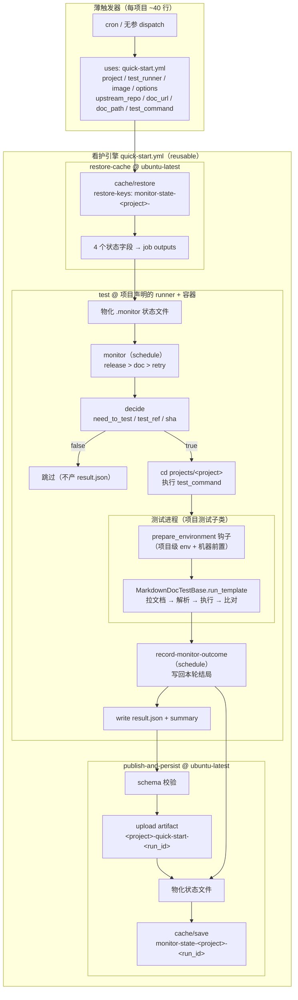
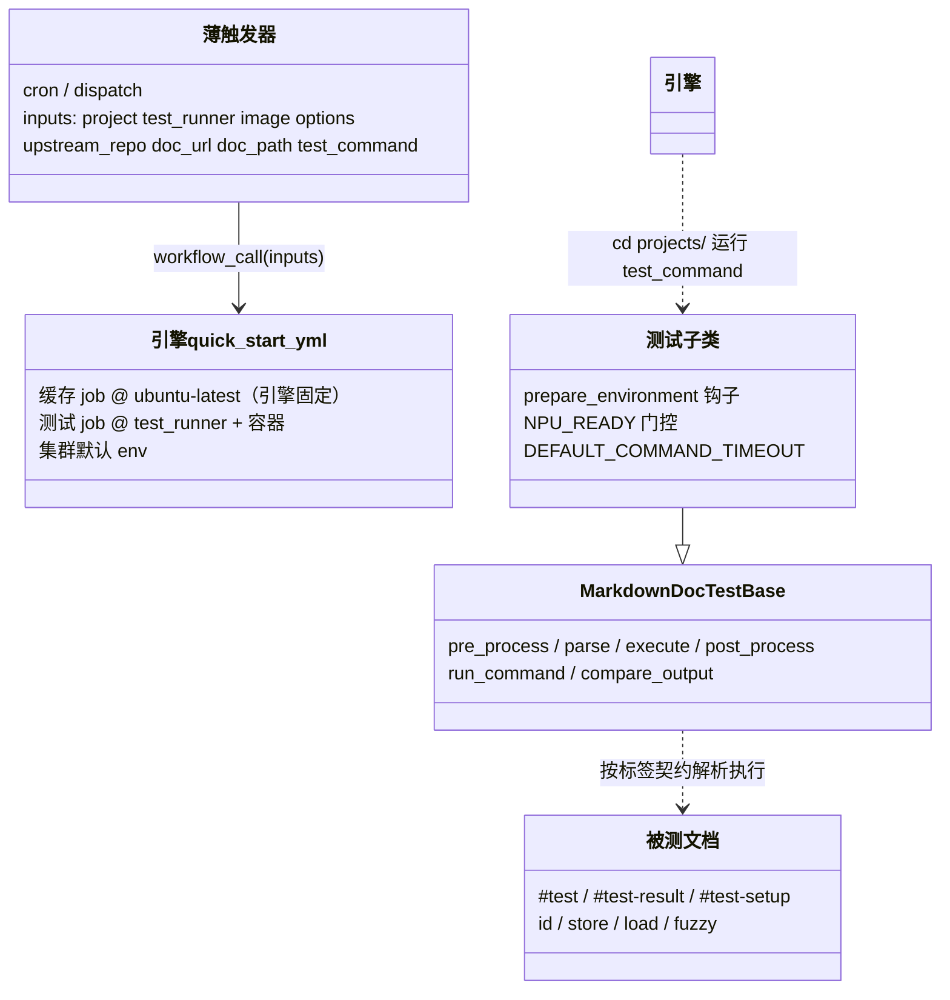

# Quick Start 看护流水线公共模板 设计文档

## 1. 设计目的

本设计基于 workflows 仓库 `hdc` 分支 `6b767af`（2026-08-22）。此时仓库已具备一条跑通的 ms-swift 单项目看护流水线，且测试侧的两层结构已经成型：

- `.github/workflows/ms-swift-quick-start.yml`（610 行）：看护流水线。三 job 骨架 `restore-cache`（ubuntu-latest，读缓存）→ `test`（NPU runner + CANN 容器，监控 + 决策 + 测试 + 记录）→ `publish-and-persist`（ubuntu-latest，schema 校验 + artifact 上传 + 存缓存）。信号链 release > doc > retry，dispatch 只读强制测试，跨 runner 四字段状态接力，失败下周期重试。
- `src/workflows/markdown_doc_test_base.py`（856 行）：共享文档执行器 `MarkdownDocTestBase`。模板方法 pre_process（拉 `MONITORED_DOC_URL`）→ parse（mistune AST + v2 标签契约校验）→ execute（顺序执行 + 捕获/替换/比对）→ post_process。框架自身依赖（mistune）由 `src/workflows/__init__.py` 在 import 时自举安装。
- `projects/ms-swift/tests/test_quick_start_ascend.py`（247 行）：项目测试子类。`NPU_READY` 门控 + `prepare_environment` 钩子（CANN env 合并、CUDA 排除约束、uv 安装、torch 栈探测、transformers/peft pin、MODELSCOPE_CACHE 沙箱）+ `run_template()` 入口。
- `projects/ms-swift/docs/Quick-start-Ascend.md`（248 行）：被测文档（v2 契约标签）。安装步骤（`uv pip install ms-swift`、clone + checkout `<ref>` + `pip install -e .`）以 `#test` / 隐藏 `#test-setup` 块写在文档里。
- `templates/project-quick-start.yml`（283 行）：v1 时代的复制模板，与线上 workflow 已严重漂移（还是"三独立信号 + checkout target + force_install"旧结构），证明复制模板路线不可维护。

目标：**把 workflow 中可公共的部分抽成公共模板（看护引擎），新增一个项目的看护从"复制修改 610 行 workflow"降为"写一份 ~40 行薄触发器 + 一个测试子类 + 一篇契约文档"，引擎零改动。**

定制的东西就是用户点名的三类：镜像（容器）与硬件选择、环境变量、前置安装内容。它们的归属是本设计的核心命题（见 2.1 / 2.3）。测试步骤本身对所有项目一样——公共执行已在 `MarkdownDocTestBase`，前置安装用项目测试子类的钩子设置。

范围约定：每项目看护一篇 quick start 文档，不支持多文档。项目是变化的维度，文档不是——这一约定砍掉多文档的状态键、多 result、结局归属等一批复杂度。

用户关心的四个问题，本设计的回答：

| 问题 | 回答 |
| --- | --- |
| 支持不同的仓库？ | `upstream_repo` 是薄触发器的一个 input，release 轮询与 SHA 解析全部参数化 |
| 镜像（容器）、硬件不一样？ | `image` / `runner` / `container_options` / `timeout_minutes` 是薄触发器的 inputs，注入引擎 job |
| 前置安装、环境变量要变？ | 前置安装归项目**测试子类钩子**（`prepare_environment`，已就位）；环境变量分两层——集群级默认在引擎 job env，项目级在钩子里设置/覆盖。注意：调用方 env 不跨 `uses:` 边界，薄触发器里写的 env 对引擎无效，这是"环境变量住哪"这个问题的硬约束 |
| 测试步骤不一样？ | 一样。引擎只跑一条 `test_command`；公共执行在 `MarkdownDocTestBase`；不一样的只有文档本身和钩子内容 |

性质：**重构**。看护语义（信号变化触发 → NPU 实测 → 结果回写 → 失败重试）不变，改变的只是"变体"的归属方式。

## 2. 设计逻辑

### 2.1 核心问题一：变体归属——什么东西因项目而异，它应该住在哪

把 610 行 workflow 里所有"换一个项目就得改"的东西列出来，逐一定层：

| 变体 | 现状位置 | 目标层 | 理由 |
| --- | --- | --- | --- |
| cron 计划 | workflow `on.schedule` | 薄触发器 | GitHub 只执行默认分支上静态声明的 schedule，引擎无法参数化 |
| 并发组名 | `concurrency.group` | 薄触发器（项目名字面量） | 并发控制在调用方（run 的入口）声明即可管住整条被调链 |
| 测试 runner 标签 | test job `runs-on` | 薄触发器 input（`test_runner`）→ 引擎 | 解析期静态值，经 `fromJSON` 注入，支持多标签。**只作用于 test job**——缓存读写 job 的 runner 是平台约束而非项目变体，由引擎固定在 GitHub 官方机器上（见 2.4"双 runner 类别"） |
| 容器镜像 / options / 超时 | `container` / `timeout-minutes` | 薄触发器 input → 引擎 | 同上；`image` 同时进 result.json |
| upstream 仓、监控文档 URL、result 的 path | workflow env / write-result env | 薄触发器 input | 纯数据（4 个字符串）。不引入独立描述符文件：引擎 monitor 阶段就要读它，而 NPU 容器里未必有 pyyaml；workflow_call inputs 是 GitHub 原生校验、零解析，且与镜像 / runner 声明同处一个评审面 |
| 集群 pip/uv 镜像 env（`UV_*` / `PIP_*`） | 测试 job env | **引擎默认**（集群级，原样搬入）+ 钩子可覆盖 | 这些 env 在**测试进程 import 阶段**就要生效（mistune 自举安装早于任何钩子），只能由引擎 job env 提供（见 2.3） |
| 项目级安装 env（CUDA 约束、缓存目录等） | 测试子类钩子 | 钩子（不动） | 已在正确位置 |
| 前置安装（CANN source、uv、torch 探测、transformers pin） | 测试子类 `prepare_environment` | 钩子（不动） | 已在正确位置（见 2.3） |
| 测试入口命令 | 硬编码 `cd ... && python -m unittest ...` | 薄触发器 input `test_command` | 个别项目换执行器的扩展点 |
| 缓存 key / artifact 名 | 硬编码 `ms-swift` 字样 | 引擎按 `project` input 派生 | 防多项目互相覆盖；ms-swift 的派生值与现状字符串相同，状态无缝延续 |
| 三 job 骨架、状态接力、信号链、失败重试、schema 校验 | 三 job 结构 | 引擎 | 平台约束与看护循环本身，不是项目变体 |

### 2.2 核心问题二：复用机制——为什么是 reusable workflow + 薄触发器

四个候选：

- **单 workflow + matrix 枚举项目**：否决。每个 workflow 文件只能声明一组 cron，无法让不同项目有不同周期；各项目容器 options、设备挂载差异大，matrix 会退化成一张越来越稀疏的表。
- **composite action**：否决。承载不了 `schedule` 触发器，也表达不了"测试 job 在 NPU runner、缓存 job 在 ubuntu-latest"这种跨 job 的输出接力。
- **复制模板（copy-template）**：否决，且有实证——`templates/project-quick-start.yml`（283 行，v1 时代产物）就是复制模板路线的产物，它与线上 workflow 已经**严重漂移**：模板还是"三独立信号 + checkout target + force_install"的旧结构，而线上已演进为 release > doc > retry 信号链、跨 runner 缓存接力、v2 测试入口。复制模板修 bug 的成本 = N 次手工同步，漏同步已经实际发生过。
- **reusable workflow（workflow_call）+ 薄触发器**（选定）：schedule 留在薄触发器；引擎 job 的 `runs-on` / `container` / `timeout-minutes` 引用 `inputs.*` 表达式（GitHub 支持）；其余变体运行期从 inputs / env 读。同仓库本地引用（`uses: ./.github/workflows/quick-start.yml`）与触发器同 commit，评审面一致。

### 2.3 核心问题三：前置安装住哪——"双层前置"概念与环境变量分层

现状里"装环境"其实发生在**两个地方**，本设计把它们显式命名为两层，并给出归属判据：

| 层 | 载体 | 内容（ms-swift 实例） | 归属判据 |
| --- | --- | --- | --- |
| **机器前置** | 测试子类钩子 `prepare_environment`（`setUpClass` 触发，每类一次） | CANN env 合并、CUDA 排除约束、uv 安装、torch 栈探测、transformers/peft pin、MODELSCOPE_CACHE | 文档《前置条件》一节声明"你的机器上需要已经装好"的东西——与镜像/集群耦合、与文档内容无关 |
| **文档安装** | 文档内的 `#test` / 隐藏 `#test-setup` 块（公共基类按文档顺序执行） | `uv pip install ms-swift`、clone + checkout `<ref>` + `uv pip install -e .` | 文档正文教用户做的操作——随文档评审，是文档语义的一部分 |

一句话判据：**文档说"机器上需要已经装好"的进钩子；文档正文教用户做的留在文档。**

前置安装放测试子类钩子（Python），而不是被 source 的 shell 配方脚本，理由：

1. **现状已经如此**：v2 落地时前置安装就已搬进测试进程（`prepare_environment`），无需再引入新载体。
2. **进程边界天然满足"同一环境"约束**：钩子改 `os.environ`，基类 `run_command` 的子进程（含文档安装块、swift CLI）全部继承。现工作流 step 1 里那次无效的 `source set_env.sh`（step 内 export 不跨 step）也因此可以删掉。
3. **Python 能表达探测与分支**：torch 栈探测（版本匹配则复用镜像内预装、否则装指定版）这类逻辑，bash 配方表达痛苦且不可单测。
4. **引擎的测试步骤退化成一条无项目知识的命令**：`working-directory: projects/<project>` + `test_command`，前置安装的复杂度整体离开 workflow 层。

环境变量随之分两层（这是"调用方 env 不跨 `uses:` 边界"约束的直接推论——薄触发器里写的任何 env 都进不了引擎）：

- **引擎默认 env（集群级）**：`UV_INDEX_URL` / `PIP_INDEX_URL` 等镜像配置，原样从现状 job env 搬入引擎。它们必须在**测试进程 import 阶段**生效——`tests/__init__.py` → `src/workflows/__init__.py` 的 mistune 自举安装发生在任何钩子之前，冷 runner 上这一步就要走集群镜像源。
- **钩子 env（项目级）**：`PIP_CONSTRAINT` / `UV_CONSTRAINT` / `MODELSCOPE_CACHE` 等在 `prepare_environment` 里设置。用**直接赋值**（而非 `setdefault`）即可覆盖引擎默认——这给了"不同集群的项目"一个覆盖点；代价是 mistune 自举仍走引擎默认源，极端场景（完全不同的集群）用 `test_command` 前置一句 `pip install mistune ...` 兜底，真实需求出现再升格为 input。

### 2.4 引擎不变量与后续演进

引擎照搬现状的语义（这些是看护循环与平台约束，不是项目变体）：

- **双 runner 类别**：流水线内部有两类 runner，职责与归属不同——
  - **缓存 runner**（`restore-cache` / `publish-and-persist` 两个 job）：引擎**固定** `ubuntu-latest`（GitHub 托管官方机器），不是项目可配项。原因：自管 NPU runner 既够不着 GitHub 的 cache blob / artifact 存储，也算不出与官方机器一致的 cache version hash（平台 / 压缩差异），缓存 I/O 必须读写都在同型托管机器上做；
  - **测试 runner**（`test` job）：项目经 `test_runner` input 声明的自管 NPU runner（标签 / 卡数因项目而异），只有它需要容器、设备挂载与集群网络。
  因此"不能用一个 runner 解决所有 job"是引擎的固定结构：三 job 骨架中，缓存字段经 job outputs 从缓存 runner 流向测试 runner（决策依据）再流回缓存 runner（持久化）；
- 信号优先级链 release > doc > retry，doc 拉取失败容错（信号未知、跳过本周期），release API 失败硬失败；
- dispatch 只读路径（强制测试、不回写状态、不存缓存——否则会清掉重试链依赖的失败标记）；
- `need_to_test` 对 record / write-result / persist 的门控，result.json schema 校验与 artifact 发布。

已知债务一并照搬，显式记录：release 与 doc 同周期都变时会"测两遍"（本周期 reason=release，下周期 reason=doc 对同一 ref 再测一次）；monitor / decide / record 的 inline bash 不可离线单测。演进方向是"陈旧规则"（一条判定覆盖三类信号）+ 决策/记录脚本化（可离线单测的纯数据变换）+ 状态 JSON 化 + 单一 `state_json` 输出通道——该方向与模板化正交，模板化完成后只剩一份拷贝，重构成本更低，本设计不实现。

### 2.5 一次调度周期的流程



测试进程内部的执行次序（env 生效时序是本设计的正确性关键）：

1. import 阶段：`tests/__init__.py` 注入 `src/` 到 sys.path → `src/workflows/__init__.py` 用**引擎默认 env**（集群镜像源）自举安装 mistune；
2. `setUpClass` → `prepare_environment` 钩子：设置**项目级 env**（约束、缓存目录；直接赋值可覆盖引擎默认）+ 机器前置安装；
3. `test_runs_doc` → `run_template()`：拉文档、解析契约、顺序执行——文档安装块与被测命令以钩子之后的 `os.environ` 为父环境。

## 3. 核心数据结构

### 3.1 薄触发器 inputs（项目声明的唯一入口）

| input | 类型 | 语义 |
| --- | --- | --- |
| `project` | string | 命名空间：缓存 key 前缀 `monitor-state-<project>-`、artifact 名 `<project>-quick-start-<run_id>`、工作目录 `projects/<project>` |
| `test_runner` | string（JSON 数组） | **仅**测试 job 的 `runs-on`（`fromJSON` 注入，支持多标签），如 `'["linux-aarch64-a2-1"]'`。缓存读写 job 由引擎固定 `ubuntu-latest`（GitHub 官方机器），不在此声明（见 2.4） |
| `image` | string | 容器镜像；同时写入 result.json 的 `image` |
| `container_options` | string | 容器 options（设备挂载、只读卷等），引擎原样使用 |
| `timeout_minutes` | string | 测试 job 超时 |
| `upstream_repo` | string | release 轮询目标 + result.json 的 `target_repo` |
| `doc_url` | string | 监控哈希与测试拉取的**同一** URL（raw 地址，机器消费；基类"无本地回退"规则的前提） |
| `doc_path` | string | result.json 的 `path` 字段——约定用 GitHub blob URL（人可点击的链接），与 `doc_url` 指向同一文件、两种表示 |
| `test_command` | string | 测试入口命令（cwd = `projects/<project>`），如 `python -m unittest tests.test_quick_start_ascend -v 2>&1` |

### 3.2 引擎与测试进程的环境契约

引擎注入测试进程（测试侧只读）：

| 变量 | 来源 | 消费方 |
| --- | --- | --- |
| `MONITORED_DOC_URL` | `inputs.doc_url`（引擎 workflow env） | 基类 `pre_process` 拉文档 |
| `UPSTREAM_REF` | decide 步骤输出 | 文档隐藏 `#test-setup` 块 `echo "${UPSTREAM_REF}"`（store=upstream_ref） |
| `NPU_READY` | 引擎置 `'true'` | 测试子类门控（防误在本地跑 NPU E2E） |
| `UV_*` / `PIP_*` 镜像组 | 引擎默认（集群级） | mistune 自举、钩子内 pip/uv、文档安装块 |

测试子类钩子设置（进程内生效、子进程继承、直接赋值可覆盖引擎默认）：`PIP_CONSTRAINT` / `UV_CONSTRAINT` / `MODELSCOPE_CACHE` / 其他项目专属变量。

### 3.3 监控状态与 result.json（结构不变，字段来源收口）

状态沿用 `.monitor-state/.monitor` 的 k='v' 单引号文件与四字段跨 job 接力（`last_release_id` / `doc_hash` / `test_result` / `test_error`），冷缓存 = 文件不存在。result.json 六个必填字段的来源：

| 字段 | 来源 |
| --- | --- |
| `trigger` | `github.event_name` |
| `reason` | record-monitor-outcome 步骤 |
| `target_repo` | `inputs.upstream_repo` |
| `target_ref` | decide 步骤 |
| `path` | `inputs.doc_path` |
| `image` / `job_status` | `inputs.image` / `job.status` |

### 3.4 组件关系



## 4. 接口定义

### 4.1 薄触发器（每项目一份，约 40 行）

```yaml
# .github/workflows/<project>-quick-start.yml
name: <project>-quick-start
concurrency:
  # format() 是刻意的：'manual-' 和 run_id 之间用 '||' 会短路。
  # cancel-in-progress: false —— 调度被取消会丢结果回写，回写是重试机制的载体。
  group: ${{ github.event_name == 'schedule' && '<project>-quick-start-schedule' || format('manual-{0}', github.run_id) }}
  cancel-in-progress: false
on:
  schedule:
    - cron: '0 */3 * * *'        # 每项目独立周期
  workflow_dispatch: {}
permissions:
  contents: read
jobs:
  quick-start:
    uses: ./.github/workflows/quick-start.yml
    with:
      project: ms-swift
      # 测试 job 的 runner（自管 NPU 机器，JSON 数组支持多标签）。
      # 缓存读写 job（restore-cache / publish-and-persist）由引擎固定跑在
      # GitHub 官方 ubuntu-latest 上——NPU runner 够不着 cache blob 存储，
      # 也不经此 input 声明。
      test_runner: '["linux-aarch64-a2-1"]'
      image: swr.cn-south-1.myhuaweicloud.com/ascendhub/cann:9.1.0-910b-ubuntu22.04-py3.12
      container_options: >-
        --privileged --shm-size=64g
        --device=/dev/davinci0 --device=/dev/davinci1
        --device=/dev/davinci_manager --device=/dev/devmm_svm --device=/dev/hisi_hdc
        --volume=/usr/local/Ascend/driver:/usr/local/Ascend/driver:ro
        --volume=/usr/local/sbin/npu-smi:/usr/local/sbin/npu-smi:ro
        --volume=/etc/ascend_install.info:/etc/ascend_install.info:ro
        --volume=/data/ci-cache/modelscope:/root/.cache/modelscope
      timeout_minutes: '180'
      upstream_repo: modelscope/ms-swift
      doc_url: https://raw.githubusercontent.com/cosdt-ci-test/workflows/main/projects/ms-swift/docs/Quick-start-Ascend.md
      doc_path: https://github.com/cosdt-ci-test/workflows/blob/main/projects/ms-swift/docs/Quick-start-Ascend.md
      test_command: python -m unittest tests.test_quick_start_ascend -v 2>&1
```

### 4.2 引擎（`.github/workflows/quick-start.yml`，reusable）

`on: workflow_call` + 4.1 的 inputs 定义。与现状的结构性差异只有七处：

- workflow env：`UPSTREAM_REPO` / `MONITORED_DOC_URL` 改为 inputs 表达式，`GH_API` 固定值；`CI_IMAGE` 锚点别名不再需要（container 与 write-result 两处都引 `inputs.image`）；
- runner 分工显式化：`restore-cache` / `publish-and-persist` 两个缓存 job 的 `runs-on` 固定为字面量 `ubuntu-latest`（**没有 inputs 通路**——缓存 I/O 必须在 GitHub 托管机器上读写同型进行，见 2.4）；只有 test job 用 `runs-on: ${{ fromJSON(inputs.test_runner) }}`；
- test job：`container.image` / `container.options` / `timeout-minutes` 引用 inputs；job env 携带集群默认镜像源（`UV_*` / `PIP_*` 从现状原样搬入）；
- 测试步骤退化为：`working-directory: workflows/projects/${{ inputs.project }}` + `run: ${{ inputs.test_command }}`；step env 注入 `NPU_READY` / `UPSTREAM_REF` / `UPSTREAM_COMMIT`，`MONITORED_DOC_URL` 继承 workflow env；
- 命名空间派生：restore-keys `monitor-state-${{ inputs.project }}-`、cache key `monitor-state-${{ inputs.project }}-${{ github.run_id }}`、artifact 名 `${{ inputs.project }}-quick-start-${{ github.run_id }}`；
- write-result 的 `TARGET_REPO` / `path` / `IMAGE` 改引 `inputs.upstream_repo` / `inputs.doc_path` / `inputs.image`；
- step 1 保留上下文打印与 `npu-smi info` 诊断，删除无效的 `source set_env.sh`（真正生效的 CANN source 在钩子里）。

monitor / decide / record / publish 各步骤的 bash 逻辑、job outputs、`if` 条件**逐行照搬**——引擎抽取是机械的参数化，不触碰看护逻辑。

### 4.3 测试子类契约（每项目一份）

```python
class TestXxxQuickStart(MarkdownDocTestBase, unittest.TestCase):
    DEFAULT_COMMAND_TIMEOUT = ...          # 可选覆写（默认 1800s）

    @classmethod
    def prepare_environment(cls) -> None:  # 钩子：机器前置（可选但推荐）
        """设置项目级 env（直接赋值可覆盖引擎默认）+ 前置安装。
        只读 env 契约：MONITORED_DOC_URL / UPSTREAM_REF / NPU_READY。"""

    @unittest.skipIf(not _e2e_enabled(), ...)
    def test_runs_doc(self) -> None:
        self.run_template()                 # 公共模板方法入口
```

接口关系总结（对准 2.5 的周期流程）：**薄触发器声明"在哪、多久跑一次、用什么镜像、看哪个仓、测哪篇文档"；引擎跑固定看护循环，到测试步时 `cd projects/<project>` 执行 `test_command`；测试子类先用钩子把"机器前置"备好（项目级 env 于此生效），再由基类按文档契约执行文档——文档安装块与被测命令运行在钩子之后的进程环境里；测试进程的退出码回到引擎，由 record / write-result / publish-and-persist 完成结局回写与发布。**

### 4.4 迁移（主要修改点与步骤）

| 现状（6b767af） | 去处 |
| --- | --- |
| workflow name / concurrency / cron | 薄触发器（项目名字面量） |
| `env.CI_IMAGE` 锚点 + container 别名 | 薄触发器 `image` input；引擎两处引 `inputs.image` |
| `env.UPSTREAM_REPO` / `MONITORED_DOC_URL` | 薄触发器 inputs；引擎 workflow env 表达式 |
| test job 的 `runs-on` / `container` / `timeout-minutes` | 薄触发器 inputs（`test_runner` 等）→ 引擎 test job；缓存 job 的 `runs-on` 保持引擎字面量 `ubuntu-latest` |
| 测试 job env 的 `UV_*` / `PIP_*` | 引擎默认（原样搬入） |
| 测试步骤 `cd ... && python -m unittest ...` | 引擎 `working-directory` + `inputs.test_command` |
| write-result 的 `TARGET_REPO` / `path` | `inputs.upstream_repo` / `inputs.doc_path` |
| 缓存 key / restore-keys / artifact 名中的 `ms-swift` 字样 | 引擎按 `inputs.project` 派生（派生值与现状相同，状态无缝延续） |
| step 1 的 `source set_env.sh` | 删除（钩子已负责；保留诊断打印） |
| `templates/project-quick-start.yml`（283 行陈旧复制模板） | 删除；README / guarding 文档的指引改为"复制薄触发器骨架" |
| `test_quick_start_ascend.py` / `markdown_doc_test_base.py` / 文档 | 不动 |

迁移两步，每步独立验证：

1. **引擎抽取 + ms-swift 触发器改写**。行为等价验证：一次 dispatch 全链路（测试跑通，result.json / artifact / 缓存 key 与旧值逐字段比对——`monitor-state-ms-swift-` 前缀不变，上轮失败标记与 doc hash 不丢）；再观察一轮 schedule（无信号时应 skip 且不产 result.json）。
2. **第二项目试点**（`feat/add-project-transformers` / `feat/llama.cpp-quick-start` 分支已有雏形可作候选）：验证成本假设——新增项目只有薄触发器 + 测试子类 + 文档三个文件，引擎零改动；同时在 `projects.yaml` 登记。

## 5. 一致性校验

- **概念一致性**：薄触发器 / 看护引擎 / 测试子类（钩子）/ 文档契约在全文各自只有一种含义；"引擎默认 env（集群级）+ 钩子 env（项目级）"与"机器前置 / 文档安装"双层判据贯穿 2.3 与 4.3；"缓存 runner（引擎固定 ubuntu-latest）/ 测试 runner（项目经 `test_runner` 声明）"双 runner 类别贯穿 2.1 / 2.4 / 3.1 / 4.1 / 4.2，input 命名 `test_runner` 自证只作用于测试 job；`project` 是缓存 / artifact / 并发组 / 工作目录的统一命名空间。
- **接口完备性**：2.1 变体表每行都有归属；3.1 的每个 input 都被引擎消费；result.json 六字段逐个有来源（3.3）；环境契约的每个引擎注入变量都有消费方（3.2）。
- **层次一致性**：引擎无项目名字面量（命名空间一律派生自 `project` input）；基类无项目知识（只认标签契约与 env 契约）；钩子无 workflow 知识；触发器无流程知识（只有声明）。新执行器格式的扩展点是 `test_command` 指向新入口，不是改引擎；未来若某项目确需多篇文档，扩展点是状态记录按文档键化，引擎结构不需要推翻。
- **状态完备性**：引擎逐行照搬现状语义——调度 / 派发 / 重试 / 冷缓存 / doc 容错 / release 硬失败 / dispatch 只读；迁移期缓存 key 前缀不变，失败标记与 doc hash 跨版本延续。
- **边界正确性（env 专项）**：调用方 env 不跨 `uses:`，故薄触发器不携带 env；mistune 自举先于钩子，故集群镜像源必须在引擎 job env；钩子内"直接赋值（覆盖引擎默认）"与"`setdefault`（尊重外部注入）"两类写法的语义不得混用错位。
- **安全**：inputs（含 `container_options`）与文档 URL 均来自本仓库默认分支（评审控制）；上游仓只读轮询红线不变；runner 执行文档内容即执行 shell，`doc_url` 默认指向本仓评审副本，直连上游文档等于在自管 runner 上执行上游作者写的 shell，采纳前需要一次明确的信任决策。
- **可测试性**：测试子类可本地手跑（`NPU_READY` 门控）；引擎的决策 bash 仍是黑盒——已知债务，由后续演进（2.4）解决；迁移第 1 步的等价性由"result.json / artifact / 缓存逐字段比对"兜底。

## 6. 变更历史

| 日期 | 变更内容 | 原因 |
| --- | --- | --- |
| 2026-08-22 | 初版：三层结构（看护引擎 / 薄触发器+测试子类 / 文档契约）、reusable workflow + 薄触发器复用机制、"机器前置 / 文档安装"双层判据、"引擎默认 env + 钩子 env"两层环境契约、`project` input 统一命名空间、引擎抽取迁移步骤 | ms-swift 单项目看护流水线需要抽出公共部分成为公共模板，其他项目仅做镜像 / 环境变量 / 前置安装定制 |
| 2026-08-22 | 显式化"双 runner 类别"：缓存读写 job（restore-cache / publish-and-persist）由引擎固定在 GitHub 托管 ubuntu-latest（无 inputs 通路），`runner` input 更名 `test_runner` 以自证仅作用于测试 job | 单一 `runner` input 易被误读为"一个 runner 解决所有 job"；自管 NPU runner 够不着 cache blob 存储，缓存 I/O 必须用官方机器读写同型进行 |
