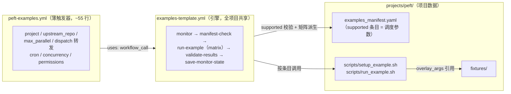
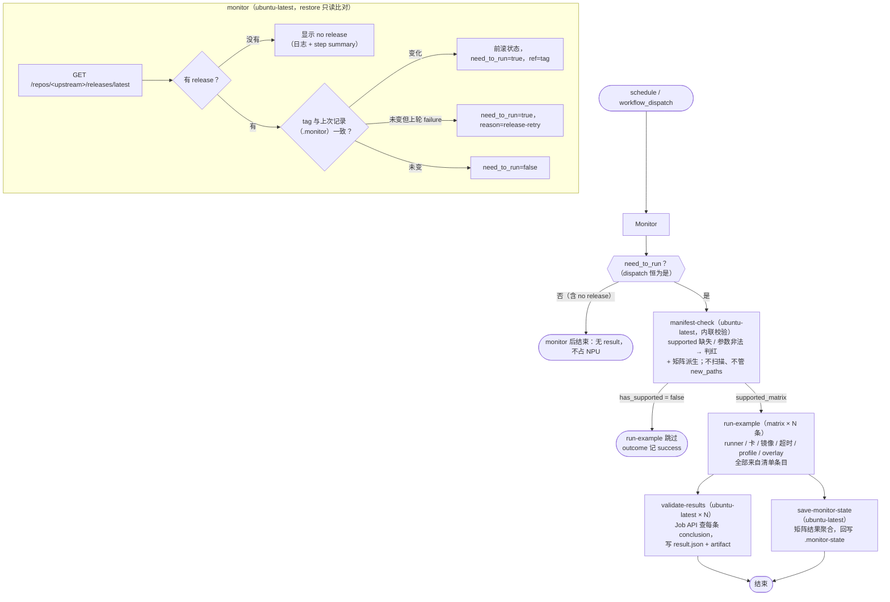

# Examples 看护工作流引擎（examples-template）设计文档

## 1. 设计目的

### 1.1 现状与目标

本仓（[cosdt-ci-test/workflows](https://github.com/cosdt-ci-test/workflows)）目前有两类看护流水线，处于两种不同的工程形态：

- **quick start 已引擎化**：公共回路在 [quick-start-template.yml](../.github/workflows/quick-start-template.yml)（823 行，`on.workflow_call`），每个项目只持有一份约 60 行的薄触发器（如 [peft-quick-start.yml](../.github/workflows/peft-quick-start.yml)）。修一个 guard 缺陷只改引擎一处。
- **examples 仍是复制式模板**：[templates/project-examples.yml](../templates/project-examples.yml) 是带 `<project>` / `<upstream_repo>` 占位符的 440 行骨架，14 个项目各持一份几乎全同的拷贝。同一个 monitor 缺陷要改 14 处；其三信号轮询（examples 树 / release / main HEAD）NPU 占用过高，ms-swift 与 trl 的 `schedule` 已被迫停用。

**本设计的目标**：产出通用引擎 `.github/workflows/examples-template.yml`（引擎 + 薄触发器形态，对齐 quick start）；监控**只保留一个信号——软件最新版本发布（release）**：上游发新版时，把清单 `supported` 条目的 example 在新版 tag 上跑一遍；**上游没有 release 时，显示没有 release，不产生执行结果**。看护回路的其余部分（supported 条目校验、矩阵调度、结果发布、outcome 回写）沿用 [ms-swift-examples.yml](../.github/workflows/ms-swift-examples.yml) 已验证的设计；**上游 example 新增发现不属于本引擎**——独立的监控 workflow（待单独设计，§2.7），新增未分类不阻塞已声明条目的执行。

以 **peft** 作为首个接入示例：peft 目前只有 quick start 看护；上游 `huggingface/peft` 的 `examples/` 有大量训练例子，是「上游无昇腾 CI」类项目的典型代表（[docs/guarding-examples.md](guarding-examples.md) 零、前提中的第三种情况）。

### 1.2 设计起点

- 本仓 HEAD `067de9a`（2026-09-10）；同日新增的 [ms-swift-examples-guard.md](ms-swift-examples-guard.md) 是单项目设计视图，本文是其通用化后续。
- peft 上游快照（2026-09-10）：latest release `v0.20.0`；`examples/sft/run_peft.sh` 是一个全参数化的 shell 训练入口（驱动 `train.py`，TRL SFTTrainer + LoRA），是 overlay 压规模的首选被测对象。
- 参考实现：[quick-start-template.yml](../.github/workflows/quick-start-template.yml)（引擎化先例）、[ms-swift-examples.yml](../.github/workflows/ms-swift-examples.yml)（看护回路全量参考）、[scripts/check_supported_entries.py](../scripts/check_supported_entries.py)（引擎的 supported 校验 + 矩阵派生脚本，可单测）；legacy 差集脚本 [check_examples_manifest.py](../scripts/check_examples_manifest.py) 本引擎不复用、[projects/trl](../projects/trl/examples_manifest.yaml)（HF 栈 example 的 ModelScope 模型预下载 + fixture 数据集模式）。

### 1.3 范围

- 通用引擎 `.github/workflows/examples-template.yml`（监控、调度、发布、回写全回路）。
- peft 接入物：薄触发器 `peft-examples.yml`、首版清单 `projects/peft/examples_manifest.yaml`、项目脚本与 fixture。
- 不在范围：存量 14 份复制式 examples workflow 的迁移（计划见 §2.6）；example 输出数值校验（只认退出码）。

### 1.4 关键约束

- runners 全部位于中国大陆：无 docker hub / HuggingFace 直连；镜像走 SWR ascendhub。pip 源按序选择：集群内缓存 → [阿里云镜像](https://mirrors.aliyun.com/pypi/simple/)（通用轮子）→ [华为云 ascend 源](https://repo.huaweicloud.com/ascend/repos/pypi)（torch_npu 等 ascend 专用轮子仅有此源）；apt 亦有阿里云 arm64 镜像可用（quick-start 引擎 bootstrap 先例）。
- 缓存键红线：examples 引擎的 monitor state cache key 为 `examples-monitor-state-<project>_<run_id>`，quick-start 引擎为 `quick-start-monitor-state-<project>_<run_id>`。归属判定是严格全键匹配——去掉尾部 run_id 后精确比较，不匹配按无缓存处理（见 §2.4.6）。两引擎前缀互不为前缀，也与 legacy workflow 的 `<project>-examples-monitor-state-` 无前缀关系。
- 被测 ref 必须可被 `actions/checkout` 解析（tag / branch / SHA）。
- 看护诚实暴露 example 退出码：overlay 参数只追加在 CI 工作区的目标仓副本上，绝不向目标仓远端做任何写操作。

## 2. 设计逻辑

### 2.1 概念空间

本设计引入的新概念：

- **examples 看护引擎（examples guard engine）**：`.github/workflows/examples-template.yml`，可复用 workflow（`on.workflow_call`），封装固定看护回路 monitor → manifest-check → run-example（matrix）→ validate-results → save-monitor-state。引擎 YAML 中不出现任何项目名、仓库名。
- **薄触发器（thin trigger）**：每项目一份 `<project>-examples.yml`，只声明项目变量——cron、并发组、`project` / `upstream_repo`、dispatch 输入转发、矩阵并行度。不含任何看护逻辑。
- **release 信号（release signal）**：上游 latest release 的 tag（`GET /repos/<upstream>/releases/latest`）。这是唯一的触发信号。
- **无版本状态（no-release）**：上游不存在 latest release（端点 404 / 解析不到 tag）时的一等公民终态：monitor 如实显示「no release」，本次 run 在 monitor 后结束，不产生 result.json、不占 NPU。
- **monitor state**：上一周期记录的 release tag 与 outcome，存 `actions/cache` 目录 `.monitor-state/`。

沿用 [guarding-examples.md](guarding-examples.md) 与 [ms-swift-examples-guard.md](ms-swift-examples-guard.md) 已定义的概念，本文不重定义：看护条目（supported entry）、profile、overlay_args、fixture、CI 输出目录、result.json。

### 2.2 引擎、薄触发器与项目数据的分工



| 变更场景 | 要改哪里 |
|----------|----------|
| 加 / 删一条 supported example | 只改项目清单 |
| example 环境族变化 | 只改项目 `setup_example.sh` |
| 看护回路缺陷 / 机制演进 | 只改引擎 |
| 新项目接入 | 薄触发器 + 清单 + 脚本，无逻辑拷贝 |

### 2.3 看护回路（一个周期）



### 2.4 关键设计选择

#### 2.4.1 引擎化边界：动态矩阵如何跨 `workflow_call`

Ray 的 opt-in 混合来源扩展：supported 条目不写 `source` 时，仍按原行为在目标/examples checkout 查找；`source: project` 时，`path` 在本仓该项目 manifest 所在目录下查找，运行时将来源传给项目 `run_example.sh`。矩阵 job 显示名统一使用完整相对路径去掉扩展名，避免不同目录的同名脚本冲突；`source` 作为可选字段写入 `result.json`，旧项目未写该字段时，矩阵和结果结构保持原样。`npu_devices` 仅在条目显式声明时写入运行环境，其他项目不受影响。Ray 的自有测试因此与上游测试共用一份 manifest，以及以最新 release 为被测版本的看护回路。

这是本设计与 quick start 引擎最关键的差异。quick start 引擎的 test job 是**单 job**：runner、镜像、超时都是 `workflow_call` inputs。examples 的调度单元是「每条 supported 条目一个 job」，runner / 卡数 / 镜像 / 超时**逐条不同**，无法用 inputs 表达（GitHub Actions 不允许 matrix 来自 workflow inputs）。

解法：把 manifest-check 作为**引擎内部 job**，从 `projects/${{ inputs.project }}/examples_manifest.yaml` 派生 `supported_matrix`（job output，由 [scripts/check_supported_entries.py](../scripts/check_supported_entries.py) 写出：只做 supported 校验与矩阵派生，不算差集——差集归发现 workflow，见 §2.7），run-example 用 `fromJSON(needs.manifest-check.outputs.supported_matrix)` 展开矩阵。这正是 ms-swift-examples.yml 现有机制，只是把写死的 `projects/ms-swift` 参数化为 `inputs.project`。

推论：薄触发器完全不感知矩阵；「加一条 supported 只改清单」的既有收益原样保留。

#### 2.4.2 监控 release + workflow-files 两信号；无 release 是一等公民状态

保留 release 触发信号为主，另加 workflow-files 信号覆盖本仓看护本身的变化，无 fallback 链：

1. **被测对象由 release 决定**：example 的行为 = example 脚本 × 它依赖的软件版本。脚本与依赖同时定版的公开时点就是发版——release tag 是「这次该测什么版本」的完整答案。main 上的中间态（无论改 src 还是改 examples）不是稳定被测对象，需要验证时用 `workflow_dispatch` 指定 ref 手动跑（仓库恒为 `upstream_repo`，界面上不提供仓库选择）。
2. **workflow-files 信号**：本项目相关文件（`projects/<project>/**` + `.github/workflows/<project>-examples.yml`）在 main HEAD 上的 blob/tree SHA 合成 hash 变了 → 在最新 release tag 上重跑一次。共用 `.monitor` 的 `last_workflow_files_hash` 字段；fire 时 `reason=workflow-files`，ref 与 release 信号 fire 时同源（最新 release tag）。priority: release > workflow-files——release fire 时 reason 与 ref 仍取 release 信号，workflow-files 仅在 release 未 fire 时生效。两信号共用同一 `need_to_run` 输出。
3. **NPU 占用最小化**：release 频率天然有限（peft 约每 1~2 月一版），schedule 轮询几乎永远只花免费 ubuntu-latest 上的几秒钟；三信号时代的 main HEAD 高频触发问题从机制上消失，schedule 可以常开。workflow-files 信号单次 tree API 调用，与 release 同价；本仓文件改动是低频事件，fire 不频繁。
4. **无 release 的语义是「如实显示」，不是「想办法触发」**：`/releases/latest` 404 或解析不到 tag 时，release 信号 `release_ref` 输出空、`need_to_run` 不被 set；本次 run 在 monitor 后结束——不产生 result.json、不占 NPU。quick start 引擎的 fallback 链（prerelease → tags → HEAD）**不移植**：那条链存在是因为 quick start 必须解析出一个可测 ref；examples 看护面对「上游从未发版」时没有东西可测，如实报告即可，把版本信号退化成 commit 监控只会把删掉的高频触发从后门加回来。

信号值比较键是 release tag；API 请求失败（空值）视为「信号未知」，不触发、不前滚状态，与 no-release 同样走 need_to_run=false 路径（区别只在日志措辞）。workflow-files 的 tree API 同理：空响应视为信号未知，不前滚 `last_workflow_files_hash`。

#### 2.4.3 状态拓扑：restore 与 save 分离，run 内单次保存

与 quick-start 引擎同构：monitor 只 restore（比读状态），save-monitor-state 只 save（run 结尾单次）。状态不经过缓存中继——save-monitor-state 需要的一切都来自 job outputs：被测 tag = `target_ref`，成败 = 矩阵聚合结果；它把这些**重建**为完整状态（tag + outcome）后一次性落盘，key 为 `examples-monitor-state-<project>_<run_id>`（每个 run 一个新 key，restore-keys 取最近保存，不存在覆盖需求——重试就是下个周期的新 run、新 run_id）。

**run 中途死亡（取消 / 超时）不保存**：什么都不写，下个周期以旧状态比对，同一个 release tag 再次触发——丢失的只是时间，不是看护轮次。这是对旧两段式写法（monitor 先落账 + 末端保存修正）的修正：那种写法下被取消的 run 会留下「tag 已前滚 + outcome 乐观置 success」的状态，下个周期反而跳过，看护轮次真丢。保存失败同理可接受：最坏代价是下周期重跑一次。

release-only 还带来一个简化：monitor 不再需要 checkout 本仓（无需读清单里的 scan.root），纯 API 轮询，几秒完成。`scan.root` 不被本引擎消费（引擎不扫描目标树），留给将来的新增发现 workflow。无信号周期不保存任何东西，缓存保活依赖每周期 restore 命中（[guarding-examples.md](guarding-examples.md) 已定性，quick-start 50 项目多月运行实证）。

#### 2.4.4 失败语义：信号级重试 + 矩阵结果聚合

- **信号级重试**：save-monitor-state 把本次成败写回 `.monitor` 的 `release_outcome`；下个周期即使无信号变化，只要 `outcome != success`，就以 `release-retry` 为由用原 release tag 再跑，直到成功。
- **矩阵聚合**：`fail-fast: false` 下，`needs.run-example.result` 任一 matrix leg 失败即 failure——语义是「全部 supported example 都绿才算绿」；manifest-check 成功且 `has_supported=false` 时 run-example 的 skipped 视为 success（空矩阵不应判红，用 if 门跳过整个 job）。
- **dispatch 不写 monitor state**（现状语义，保留）——否则手动跑会污染失败标志，干扰下个 schedule 周期的重试判定。

#### 2.4.5 并发模型

薄触发器持有 workflow 级并发（quick-start 模式）：schedule 走固定组 `<project>-examples-schedule`（定时轮询串行化）；manual 走 `manual-<run_id>`（每次手跑独立成组，不被定时跑阻塞）。`cancel-in-progress: false`：被取消的 run 会丢失 outcome 回写，而 outcome 正是重试机制的输入。

#### 2.4.6 缓存键：严格匹配防串扰

monitor state 的检索原语只有 restore-keys 前缀匹配 + 取最近命中——GitHub Actions 不提供按 namespace 隔离的缓存机制，防跨项目串扰靠 key 文法 + 恢复后的严格校验。

键文法：`<引擎前缀>-monitor-state-<project>_<run_id>`。examples 引擎与 quick-start 引擎使用各自的前缀：

```
examples 引擎:
  save key（save-monitor-state，run 结尾单次）: examples-monitor-state-<project>_<run_id>
  restore-keys:                             examples-monitor-state-<project>_

quick-start 引擎:
  save key（publish-and-persist 保存）: quick-start-monitor-state-<project>_<run_id>
  restore-keys:                        quick-start-monitor-state-<project>_
```

**归属判定：严格全键匹配**。恢复后断言 matched key 匹配 `^<引擎前缀>-monitor-state-<project>_[0-9]+$`——等价于「去掉尾部 `_<run_id>`，剩余部分精确等于『引擎前缀 + 本项目名』」，不匹配即外来 key，按无缓存处理。数字结尾锚定使这一判定**不依赖项目名的字符集**：即使某项目名含 `_`（如 `peft_npu`），它的 key 也通不过 `peft` 的断言（`peft_` 之后必须是纯数字）——正确性由严格匹配保证，不靠命名纪律。

项目名放尾部让全部条目共享引擎前缀，`gh cache list --key examples-monitor-state-` / `--key quick-start-monitor-state-` 一条命令即可审计单个引擎的缓存。

运行时校验（非致命）：**matched-key 严格断言**（上文）——拒绝一切外来 key，含误写裸 restore-keys 命中任意项目的情形。

**校验失败语义：不判红，当作没有缓存**。失败时发出 `::warning` 注解（run 页面可见），丢弃已恢复的状态，本周期按冷启动继续——monitor 以空状态比对，release 信号自然触发，看护自愈。取舍：判红能阻止「烧一轮 NPU 才发现配置问题」，但会阻塞该项目看护直至人工介入，且串扰是极小概率事件；用一轮多余看护换看护可用性，是正确的代价分配。quick-start 引擎使用相同的断言（key 前缀 `quick-start-monitor-state-<project>_`）。

### 2.5 peft 接入示例（首个薄触发器）

peft 侧新增（引擎零改动）：

1. **薄触发器 `peft-examples.yml`**：`upstream_repo: huggingface/peft`，见 §3.2。bring-up 阶段 schedule 注释、只开 dispatch（与 trl 同策略），手动跑绿几个回合后启用 cron。
2. **清单**：`scan.root: examples`、`include_extensions: ['.sh', '.py', '.yaml']`（`.ipynb` 排除）。**2026-09-14 在 coder npu-3（910B4×2）完成全量逐例验证**（28 条实测 + 其余静态分析）：supported 扩至 9 条——`run_peft.sh` + beft / miss / mica / pvera / seq_cls / adamss_glue / adamss_manual / supertuning（全部 exit 0 或 CI 绿）；unsupported 84 条每条附理由注释：NPU 硬阻塞 8 条实测确认（sparse 算子族 shira/frod×2、backward 崩溃 kasa/unilora、`optimizer.step(grad_scaler=)` 族 gralora/lily/peanut）、依赖阻塞（bnb/GPTQ/TE/HPU/mistral.rs/unsloth/70B）、7B/8B 家族未逐例验证。依赖线 pin 见 setup_example.sh（transformers 4.57.1 / datasets 3.6.0 / hub<1.0 / trl 1.12.0）。
3. **项目脚本**：`setup_example.sh` 单 profile `peft`——torch 栈复用镜像（CANN 9.1.0 + torch 2.9.0 线，与 peft quick-start 同线）后 `pip install -e "$TARGET_ROOT"`（**装 release checkout 本身**，被测 tag 即被装代码）+ trl / datasets；模型按 trl 项目验证过的模式从 ModelScope 预下载（`Qwen/Qwen2.5-0.5B`，export `SFT_MODEL_PATH` 供 overlay 引用）；fixture 数据集复制进 `$TARGET_ROOT/fixtures/`。`run_example.sh` 按 [guarding-examples.md](guarding-examples.md) 通用契约：给脚本注入 `"$@"`、展开 `OVERLAY_ARGS`、退出码即结果。

上游 `examples/sft/requirements.txt` 全部从 GitHub main 装（transformers/peft/trl@main + flash-attn + unsloth），与「测 release tag」的目标冲突且含 NPU 不可用依赖——setup 不安装它，只装被测 checkout + SFTTrainer 最小栈，overlay 关闭 `--use_4bit_quantization` / `--use_flash_attn`（bitsandbytes / flash-attn 无 NPU 后端）。

### 2.6 存量迁移计划（后续工作，不在本期范围）

1. 新项目一律走引擎；`templates/project-examples.yml` 标记 deprecated。
2. 存量 14 份分批迁移：每项目 = 写薄触发器 + 删复制式 YAML；监控语义同时收敛为 release-only（旧三信号状态文件 `.examples_head` / `.last_tested_sha` 等成为无主文件）；cache key 切换到引擎格式（§2.4.6）→ 每项目冷启动一轮（[guarding-examples.md](guarding-examples.md) 已定性「无害」）。
3. [guarding-examples.md](guarding-examples.md)「要求 2」的三信号描述随引擎落地同步更新。

### 2.7 不在范围内的事

- 不校验 example 输出数值（loss 等），只认退出码。
- 不为引擎另建 result schema，沿用 [schemas/result.schema.json](../schemas/result.schema.json) 与 [manifest_check_result.schema.json](../schemas/manifest_check_result.schema.json)。
- 不跨 runner 切分单条 example（`max-parallel` 上限语义不变）。
- 不改写上游 example 本体；看护失败如实标红，修复走上游 PR。
- **不做上游 example 新增发现**（磁盘有、清单无的 new_paths）：本引擎只对已声明的 supported 条目负责，新增未分类**不阻塞执行**；「上游多了什么该纳入看护」是独立关注点，后续单独设计监控 workflow（定期扫描目标树与清单求差集、报告新增——形态待定）。
- **扫描模型简化为 files-only**（发现 workflow 采用；legacy 的 `unit: directories / mixed` 连同 marker / max_depth 废弃）：对账单位统一为**入口文件**——`scan` 只有两个键：`root`、`include_extensions`（只扫这几类，`.h`/`.md` 天然不进）。多文件 example 的内部 helper 源文件、`__init__.py`、上游自测等"不是 example 的配套物"一律登记在 `unsupported` 段（扫描引擎不消费的"声明性 exclude"字段已退役——曾经 8 份清单依赖它过滤扩展名之外的文件，但引擎本身从未实现 exclude，对账单位与 `load_scan` 实测一致）。随之 `path` 语义统一为**入口源文件**；`exec` 仅剩一种用途——path 是源码而启动的是构建产物（llama.cpp：`path: examples/simple/simple.cpp` + `exec: build/bin/llama-simple`）；python/shell 例不需要 exec，启动命令由项目脚本按扩展名分发（`.sh` → bash，其余 → python，解释器即 setup 装依赖的那个）。实施为独立 PR（涉及扫描脚本与 llama.cpp / whisper.cpp / trl 三个存量清单迁移），不混入本 PR。

## 3. 核心数据结构

### 3.1 引擎输入（`on.workflow_call.inputs`）

| input | 类型 | 默认 | 说明 |
|-------|------|------|------|
| `project` | string | 必填 | `projects/` 下的项目目录名。派生：清单路径、cache key `examples-monitor-state-<project>_*`、artifact 名前缀 |
| `upstream_repo` | string | 必填 | `owner/name`。monitor 轮询对象、checkout 的目标仓（唯一来源，dispatch 不提供仓库选择） |
| `target_ref` | string | `''` | dispatch 专用：被测 ref（空则 `main`）；schedule 时恒由 monitor 的 release tag 决定 |
| `examples_repo` | string | `''` | 分离模式：example 脚本所在仓（不填即用 `upstream_repo`）。填写后 examples 单独 checkout 到 `examples/`（跟默认分支，release tag 跨仓不存在），经 `EXAMPLES_ROOT` 暴露给项目脚本；`target` 仍是被测仓 `@ target_ref` 的 checkout，setup 安装源契约与普通模式同形 |
| `max_parallel` | number | `4` | run-example 矩阵并行上限 |

容器零挂载：该 CI 的 runner 无法提供 host 路径挂载（`/data/ci-cache`、Ascend driver 等），自托管 runner 的容器默认可见 NPU 设备（与 quick-start 引擎同一假设）。卡数由 runner 标签钉死（`linux-aarch64-a2-N` 即 N 卡，选对 runner 即选对卡），本设计无任何卡配置字段——schema 已删除 `npu_devices`，peft 清单不含它。legacy 清单里的 `npu_devices` 是旧设计遗留，共享脚本检测到时仍为其派生设备挂载（兼容，不属于本设计）。容器零 options：首轮 run 实测 `/dev/shm` 为 16G（runner 自带，非 docker 默认 64MB），`--shm-size=64g` 未被应用且该负载 shm 用量为 0——已删。Run example 步骤保留一行 `df -h /dev/shm` 诊断。模型缓存无需挂载：ModelScope 走容器内默认缓存目录（`~/.cache/modelscope`），容器销毁即丢，但 release 触发频率低，重下载可接受。镜像、runner、超时逐条目来自矩阵——引擎 YAML 不出现任何调度参数。

### 3.2 薄触发器 `peft-examples.yml`（全文骨架）

```yaml
# peft examples guard - project thin trigger.
# Calls the common engine .github/workflows/examples-template.yml;
# this file only declares what varies per project: schedule,
# concurrency, upstream repo, dispatch input forwarding, and matrix
# parallelism. The guard loop (monitor / manifest-check / run-example
# matrix / validate-results / save-monitor-state) lives in the engine.

name: peft-examples

concurrency:
  # schedule runs serialize; each manual run gets its own group so a
  # dispatch is never blocked behind a scheduled run.
  group: ${{ github.event_name == 'schedule' && 'peft-examples-schedule' || format('manual-{0}', github.run_id) }}
  # false: a run cancelled mid-way loses its outcome writeback, and the
  # outcome is what drives the next cycle's retry.
  cancel-in-progress: false

on:
  # Bring-up phase: keep the schedule disabled until a few manual
  # rounds are green (same policy as trl-examples.yml). Re-enable:
  # schedule:
  #   - cron: '30 */6 * * *'
  workflow_dispatch:
    inputs:
      target_ref:
        description: Branch, tag, or SHA to test
        required: false
        default: main
        type: string

# Engine jobs query the GitHub Job API (validate-results) — actions:read
# must be granted here; called workflows inherit caller permissions.
permissions:
  actions: read
  contents: read

jobs:
  peft-examples:
    uses: ./.github/workflows/examples-template.yml
    with:
      project: peft
      upstream_repo: huggingface/peft
      target_ref: ${{ inputs.target_ref }}
      max_parallel: 4
```

### 3.3 Monitor state（`.monitor-state/`）

单文件 `.monitor-state/.monitor`（bash 可 source 的 key=value，与 quick-start 同构）：

```
last_release_tag='v0.20.0'   # 上次已看护的 release tag（比对键 + 重试时的被测 ref）
release_outcome='success'    # 上次成败；failure 驱动下周期 release-retry
```

经 `actions/cache` 持久化：key `examples-monitor-state-peft_<run_id>`（save-monitor-state 在 run 结尾单次保存；monitor 只 restore 只读比对），restore-keys 前缀 `examples-monitor-state-peft_`——文法与运行时校验见 §2.4.6。与 quick-start 的 `quick-start-monitor-state-peft_` 互不为前缀。

### 3.4 peft 首版清单 `projects/peft/examples_manifest.yaml`

```yaml
version: 1
scan:
  root: examples
  # .ipynb 有意排除：notebook 不是可直接 CI 执行的 example 形态
  include_extensions: ['.sh', '.py', '.yaml']
supported:
  - path: examples/sft/run_peft.sh          # 上游唯一全参数化 shell 训练入口
    profile: peft
    runner: linux-aarch64-a2-1              # 单卡 runner，卡数由标签钉死
    image: swr.cn-south-1.myhuaweicloud.com/ascendhub/cann:9.1.0-910b-ubuntu22.04-py3.12
    overlay_args:                            # 压 CI 规模 + 关 NPU 不兼容开关（完整版见清单）
      - --model_name_or_path ${SFT_MODEL_PATH}     # setup 从 ModelScope 预下载并 export
      - --dataset_name ${TARGET_ROOT}/fixtures/ci_sft_8.jsonl   # 8 行 chatml fixture
      - --use_4bit_quantization False       # bitsandbytes 4bit 无 NPU 后端
      - --use_flash_attn False              # flash-attn 仅 CUDA
      - --max_steps 1
      - --output_dir ${CI_OUTPUT_DIR}
    timeout_minutes: 90
unsupported:
  # bootstrap 扫描生成；run_peft_*.sh 系（deepspeed/fsdp/qlora 多卡或依赖栈复杂）
  # 首轮全部 unsupported，跑绿后再逐条迁入 supported
```

数据集不走 HF hub：`train.py` 的 `create_datasets` 以 `load_dataset(dataset_name)` 直通调用，fixture 本地 jsonl 由 `run_example.sh` 的 dataset shim 改写为 `load_dataset("json", data_files=...)`（trl 项目已验证的机制，且为 peft 的 `splits="train,test"` 双 split 取数把单文件映射为两个 split）。

### 3.5 结果产物（沿用，不改）

- 每条约 result.json（无论成败）由 validate-results 调 [scripts/write_example_result.py](../scripts/write_example_result.py) 写出（Job API 查 conclusion → 归一化 → 写 JSON）、过 [result.schema.json](../schemas/result.schema.json) 校验，artifact 名 `peft-examples-<run_id>-<job-index>`。
- manifest-check 不产 artifact：supported 校验失败直接在 run 日志可见（stderr 列出缺失/非法条目），矩阵经 job outputs 内传；对外结果只有每条约一份的 result.json。差集产物（`new_paths` 等）归将来的发现 workflow。
- no-release 周期不产生任何 result 产物，monitor 的 step summary 即全部输出。

## 4. 接口定义

### 4.1 引擎对外接口（workflow_call）

见 §3.1 输入表。接口语义总结：**接入一个新项目的全部工作 = 薄触发器声明这 4 个输入 + 提供一份清单和两个脚本**；引擎负责其余一切。

### 4.2 上游轮询接口（monitor job，GitHub REST API）

```
GET /repos/<upstream_repo>/releases/latest    → release 信号（tag_name）
```

单一端点，无 fallback 链。404 / 空 tag → no-release 路径（§2.4.2）。每个 schedule 周期一次调用，未认证限额足够。

### 4.3 项目脚本契约

完整沿用 [guarding-examples.md](guarding-examples.md)「项目运行脚本契约」：`setup_example.sh <profile>`（未知 profile 装任何东西前非 0 退出）与 `run_example.sh <example-relpath>`（env 契约 `PROJECT_ROOT` / `TARGET_ROOT` / `FIXTURE_DIR` / `CI_OUTPUT_DIR` / `OVERLAY_ARGS` / `EXEC`；退出码即结果；红线：只改 CI 工作区副本，绝不 git add/commit/push）。本文不重复定义，peft 脚本按此实现。

分离模式（薄触发器传了 `examples_repo`）下的增量契约：引擎提供 `EXAMPLES_ROOT`（examples 仓 checkout，位于 `examples/`，跟其默认分支），manifest 里的 example 路径与 `run_example.sh` 的解析根指向它；`TARGET_ROOT` 仍是被测仓 `@ target_ref` 的 checkout，setup 脚本照旧从它安装被测软件（`pip install -e "$TARGET_ROOT"`），与普通模式同形，被测版本仍由 release 信号定版。非分离模式下 `EXAMPLES_ROOT` 与 `TARGET_ROOT` 同值，现有项目脚本无感知。

### 4.4 内部接口（引擎 job 间）

- **monitor → manifest-check / run-example / validate-results**：job outputs `need_to_run` / `trigger` / `target_ref`（`need_to_run`：本周期是否需要执行——新 release、失败重试或手动触发；`reason` 仅存于 monitor 内部日志，不再是 job output）；下游 checkout 目标仓、result.json 记 `trigger` / `target_ref`。
- **manifest-check → run-example / validate-results**：job outputs `supported_matrix`（JSON 数组，条目含 `device_options` 派生值）/ `has_supported`；空矩阵时两个下游 job 整体跳过。
- **run-example → validate-results**：不传数据，validate-results 调 `scripts/write_example_result.py`（Job API 按 `run-example (<path>)` job 名查 conclusion——**后缀匹配**：可复用 workflow 的 Jobs API 会给 job 名加 `<调用方名> / ` 前缀，如 `peft-examples / run-example (…)`；urllib 分页，无 gh/jq 依赖）——NPU runner 不写 artifact，发布统一在 GitHub 托管 runner 上完成。
- **monitor + run-example + manifest-check → save-monitor-state**：被测 tag 取自 `needs.monitor.outputs.target_ref`，成败由 `needs.run-example.result`（矩阵聚合）+ `needs.manifest-check.result` + `has_supported` 映射为 `success` / `failure`；save-monitor-state 不 restore，直接重建单文件状态（tag + outcome）单次保存（§2.4.3）。

### 4.5 与 quick-start 引擎的对照

| 维度 | quick-start-template | examples-template（本设计） |
|------|----------------------|------------------------------|
| 被测单元 | 单 test job（runner / 镜像来自 inputs） | 矩阵 × N（runner / 卡 / 镜像 / 超时来自清单条目） |
| 信号 | release（fallback 链至 /commits/HEAD）+ doc hash + retry | release（单一端点、无 fallback）+ retry；no-release 是一等公民终态 |
| 状态拓扑 | restore → outputs 中继 → publish-and-persist 单次保存 | 同构：monitor 只 restore，save-monitor-state 由 outputs 重建状态单次保存（§2.4.3） |
| result.json `path` | 被测文档 URL | 被测 example 路径（每条一份） |
| dispatch | 无输入，直测最新 release | 仅 `target_ref`（默认 main）；仓库恒为 upstream_repo |
| 并发模型 | caller 持有（schedule 组 + manual 组） | 相同（本设计对齐） |
| dispatch 写状态 | 否 | 否（相同） |
| cache key | `quick-start-monitor-state-<project>_<run_id>`（同严格格式） | `examples-monitor-state-<project>_<run_id>`（同严格格式） |

## 5. 一致性校验

| 维度 | 校验 |
|------|------|
| 概念一致性 | 全文统一使用「引擎 / 薄触发器 / release 信号 / no-release / 看护条目 / profile / overlay_args / monitor state」；「无 release」与「API 失败（信号未知）」是两个概念，均走 need_to_run=false，但日志与 summary 措辞区分。 |
| 状态完备性 | 单信号 ×（新 tag / 同 tag / API 失败）× outcome（success / failure / 不存在）：新 tag → 前滚 + 触发 + outcome 重置；同 tag 且 outcome=failure → `release-retry`；同 tag 且无失败 → 不触发；API 失败 → 不触发不前滚；no-release → 显示后结束。dispatch → 恒触发、不读写状态。manifest 无 supported → run-example skipped 记 success；supported 磁盘缺失或参数非法 → manifest-check 判红（不进 NPU）；上游新增未分类 → 不阻断（归发现 workflow）；矩阵任一 leg 失败 → failure 重试。 |
| 接口完备性 | 回路每个数据流都有承载：轮询（GitHub API）、信号比对（monitor state）、supported 校验（manifest-check 内联）、环境（setup_example.sh）、执行（run_example.sh）、结果（validate-results + result.schema）、重试（save-monitor-state）、项目声明（workflow_call inputs + 薄触发器）。 |
| 层次一致性 | 引擎只做触发判断、调度矩阵、结果收集；环境准备归项目脚本，清单扫描归共享脚本，cron / 并发归薄触发器；引擎 YAML 无任何项目名 / 仓库名 / 调度参数（§3.1 检查成立）。 |
| 红线 | cache key 归属判定为严格全键匹配（引擎前缀 + 项目名 + `_` + 结尾 run_id，去掉尾部 run_id 后精确比较）；matched-key 断言**非致命**——失败时告警并按冷启动继续，不阻塞看护（§2.4.6）；`run_example.sh` 绝不对目标仓远端做写操作；dispatch 不写 monitor state。 |
| 兼容性 | 引擎 job 结构与 ms-swift-examples.yml 同构；存量项目迁移时监控语义同时收敛为 release-only（examples/commit 信号退役）、cache key 切换致每项目一轮冷启动（§2.6）；`templates/project-examples.yml` 与本引擎并存至迁移完成。 |
| 文档一致性 | [guarding-examples.md](guarding-examples.md)「要求 2」的三信号描述需随引擎落地更新为 release-only（§2.6 第 3 条）；quick-start 相关文档不受影响。 |

## 6. 变更历史

| 日期 | 变更内容 | 原因 |
|------|----------|------|
| 2026-09-20 | 新增 workflow-files 信号：`monitor-release` step 改名为 `monitor`，内部分两信号区块（release + 本项目文件 SHA），共用 `.monitor` state。监控本项目相关文件（`projects/<project>/**` + `.github/workflows/<project>-examples.yml`）在 main HEAD 上的 blob/tree SHA 合成 hash，变化即 fire `reason=workflow-files`，ref 取最新 release tag。priority release > workflow-files。两信号共用同一 `need_to_run` 输出。`.monitor` 文件新增 `last_workflow_files_hash` 字段；decide step 简化为 4 行透传。 | 用户要求：本仓 example 监控相关文件改动也能触发看护，无需等 6 小时 schedule。复用 monitor-release 的 release API 调用作 ref，workflow-files step 不重复调 release；fire-and-forget，不防 retry 风暴（与现有 release 信号同形，靠 release-outcome=failure 推动 release-retry）。 |
| 2026-09-16 | 引擎新增可选输入 `examples_repo`（分离模式）：example 脚本与被测软件分属两仓时（如 deepspeed：监控 `deepspeedai/DeepSpeed`，脚本在 `deepspeedai/DeepSpeedExamples`），examples 单独 checkout 到 `examples/`（跟默认分支）并以 `EXAMPLES_ROOT` 暴露；`target` 与 `TARGET_ROOT` 语义不变（被测仓 `@ target_ref`），setup 安装契约对所有项目同形。存量步骤零修改，不传输入时行为与此前逐字一致。 | PR 评审：原方案给存量 checkout 加条件并新引 `UPSTREAM_ROOT`；改为「只加步骤、不动存量」后回归面更小、契约更统一。代价是分离模式下 manifest-check 多一次主仓 checkout（免费 runner，可接受）。examples 仓跟默认分支而非 main：DeepSpeedExamples 默认分支为 master，且 release tag 跨仓不存在。 |
| 2026-09-10 | 初版设计：examples 看护引擎化（引擎 + 薄触发器），监控信号由三（examples / release / commit）收敛为二（examples / release），scan.root 单一事实源，以 peft 为首个接入示例。 | 14 份复制式 examples workflow 维护成本高；commit 信号 NPU 占用过高致 schedule 停用；quick start 已验证引擎化形态。 |
| 2026-09-10 | monitor state cache key 改为严格格式 `examples-monitor-state-<project>_<run_id>`：项目名禁 `_`、`_` 作终止分隔符、项目名移到尾部；配套三道运行时校验（project 输入校验、matched-key 断言、`.project` 属主标签）。 | 评审确认：`-` 分隔时项目名互为前缀（peft / peft-npu 类）可致 restore-keys 跨项目串扰，且 GitHub 缓存无 namespace 隔离机制；分隔符与名字字符集互斥可获得构造性保证，尾部命名同时支持按引擎前缀整体审计（gh cache list）。 |
| 2026-09-10 | 监控再收敛为 release 单信号：删除 examples 信号与信号吸收语义，`scan.root` 回归纯差集概念；no-release 成为一等公民终态（显示后结束、无 result）；release 轮询不做 fallback 链；monitor 不再 checkout 本仓。 | 被测对象（example × 软件版本）由 release 定版，main 中间态不是稳定被测对象；无 release 时如实显示优于制造触发；单信号使状态机与 monitor 实现最小化，NPU 占用与发版频率天然同频。 |
| 2026-09-11 | 属主校验改为非致命：matched-key 断言与 `.project` 标签校验失败时告警并丢弃缓存、按冷启动继续，不再判红阻塞看护。quick-start 引擎同步硬化：key 改名 `quick-start-monitor-state-<project>_<run_id>`（严格格式）、restore-cache 增加相同校验、publish-and-persist 落盘属主标签；旧前缀条目一次性全部失联（每项目冷启动一轮，接受）。 | 评审决策：串扰是极小概率事件（key 已构造性防碰，校验只是纵深防御），判红会为它阻塞整个项目看护；一轮多余看护换可用性是正确代价。quick-start 旧格式 `monitor-state-<project>-` 有同样的项目名前缀弱点，一次冷启动成本可接受，无需分期。 |
| 2026-09-11 | monitor 的裁决输出由 `changed` 更名 `need_to_run`：release-only 语义下它表达「本周期是否需要执行」（新 release / 失败重试 / 手动触发），多数为 true 的场景并不是「变化」，旧名失真；tag 保留双重角色——变化判断的比较键 + 被测 ref。 | 命名评审：`changed` 是三信号时代的遗产，单信号下名不副实。 |
| 2026-09-11 | 移除两引擎的 project 输入校验步骤；§2.4.6 重写为「严格全键匹配」框架：键归属判定 = 去掉尾部 `_<run_id>(-post)?` 后精确比较，数字结尾锚定使判定不依赖项目名字符集；`_` 禁令由机器校验降级为命名约定（仅避免 restore 取到他人条目的退化，正确性由严格匹配保证）。 | 评审结论：断言以纯数字结尾锚定，项目名含任意字符都不影响归属识别，输入校验无增益；严格匹配不通过即无缓存，正确性不依赖命名纪律。 |
| 2026-09-11 | 移除「项目名约定不含 `_`」条款及分隔符选型说明（文档与两引擎注释），项目名零约束。 | 评审结论：约定无强制力，正确性由严格全键匹配独立保证，外来 key 无论来源一律被断言拒绝——条款只增加文档噪音。 |
| 2026-09-11 | monitor state 改为 run 内单次保存（quick-start 同构）：删除 monitor 的中途保存与 `-post` 键，record-outcome 不再 restore、由 monitor outputs（target_ref）+ 矩阵结果重建状态后单次落盘；断言正则去掉 `(-post)?`。 | 评审结论：两段式保存下被取消的 run 留下「tag 已前滚 + outcome 乐观置 success」，下周期跳过、看护轮次真丢；单次保存 + 允许保存失败，最坏代价是下周期重跑一次。重试即新 run 新 run_id，不存在 key 覆盖需求。 |
| 2026-09-11 | monitor state 收敛为单文件 `.monitor`（与 quick-start 同构）：删除 `.project` 属主标签（两引擎——闭环内不可能独立触发）、`.release_failure_reason`（写而无读的死状态）、`reason` 的 BASE 路由与 job output（单信号单文件后无消费者，仅存于 monitor 日志）。 | 评审结论：多文件是三信号时代遗产；属主标签唯一保存方是引擎自身，key 合法则内容必然是自己的，标签只在「手工向合法 key 塞他人状态」时触发，闭环比不存在。 |
| 2026-09-11 | run-example 容器移除全部 host 挂载（/data/ci-cache 系列、Ascend driver / npu-smi / ascend_install.info 只读挂载、davinci 设备透传与 device_options 引用、MODELSCOPE_CACHE env）：容器 options 仅剩 --shm-size，卡选择只靠 ASCEND_RT_VISIBLE_DEVICES，npu-smi 降级为 best-effort 诊断。模型缓存走容器内默认目录（ModelScope `~/.cache/modelscope`），无需挂载。 | 该 CI 无法提供磁盘挂载，配置为死代码；quick-start 引擎已验证 runner 容器默认可见 NPU 设备。 |
| 2026-09-11 | 上游 example 新增发现移出本引擎的关注点（引擎只对已声明的 supported 条目负责），列为独立监控 workflow 待办（§2.7）；manifest-check 继续复用共享脚本原样调用（差集字段照算，引擎不消费 `new_paths`，留给将来的发现 workflow 读）。 | 评审决策：「跑绿已支持的」与「发现该纳入的」是两个关注点，执行流水线不为后者负责；不改共享脚本，避免为 14 个 legacy 调用方引入分叉行为。 |
| 2026-09-11 | `npu_devices` 从设计中移除：schema 删除该字段、引擎删除 `ASCEND_RT_VISIBLE_DEVICES` env、peft 清单不含它；共享脚本检测到 legacy 清单带该字段时仍派生设备挂载（兼容行为，不影响 14 个存量调用方）。 | runner 标签 `linux-aarch64-a2-N` 已钉死卡数，字段无独立信息（ms-swift 清单全部条目的 npu_devices 恰等于 runner 全卡）。 |
| 2026-09-11 | run-example 移除全部软件栈假设：删 "Check torch_npu" 步骤、"Source CANN and check NPU" 步骤、Run example 步骤内硬编码的 CANN source——CANN 环境与栈校验由项目脚本自理（peft 的 setup/run 脚本本就各自 source）。引擎步骤收敛为 checkout × 2 → setup → run。 | 并非所有项目跑 torch 栈（opencv 走 OpenCV CANN 后端）；引擎对镜像内容零假设，硬编码 source 在无该路径的镜像上是与 example 无关的红。 |
| 2026-09-11 | manifest-check 与共享脚本解耦：改为内联自包含校验（supported 存在性 + 参数合法 + 矩阵派生），不再调用 check_examples_manifest.py、不产 manifest_check_result.json artifact、不做 schema 校验步骤；共享脚本 / 测试 / schema 全部还原到 HEAD（legacy 零影响）。新增发现（new_paths）彻底移出引擎，恢复为独立 workflow 待办（§2.7）。上一轮曾让共享脚本对 new_paths 判红，判定为过度：「没来得及归类的新 example」与「清单该跑的条目坏了」是两回事，前者不应阻塞后者的执行。 | 引擎只对已声明的 supported 条目负责；新增发现是独立关注点，待单独设计。 |
| 2026-09-11 | manifest-check 的内联校验抽出为脚本 `scripts/check_supported_entries.py`（CLI 与同目录脚本一致：`--target-root` / `--manifest`，GITHUB_OUTPUT 产出矩阵），引擎恢复 `python3 workflows/scripts/...` 调用形态；新增 5 个单测（tests/test_check_supported_entries.py）。 | 引擎私有逻辑也应放全仓共用脚本目录并可单测——内联 heredoc 验证时需从 YAML 里抠代码，不可维护。 |
| 2026-09-11 | validate-results 的 "Write result JSON" 内联 bash+python 抽出为 `scripts/write_example_result.py`（Job API 查询改 urllib 分页，去掉 gh/jq 依赖；conclusion 归一化与 JSON 写出可单测），新增 5 个单测；引擎步骤收敛为一行调用。 | 与 check_supported_entries.py 同一模式：引擎私有逻辑放 scripts/ 可单测，workflow 里不藏代码。 |
| 2026-09-11 | record-outcome job 更名 save-monitor-state（职责即“持久化 monitor state，run 内唯一保存点”），并注明与 validate-results 并行是有意设计：发布问题不得门控状态回写或触发 NPU 重跑，且尽早落盘缩小取消丢失窗口。 | 命名评审：record-outcome 像记日志，名不副实；执行顺序评审确认二者无依赖、不应串行。 |
| 2026-09-14 | 删除容器 `options: --shm-size=64g`（含 TODO）：首轮 NPU run（dispatch, peft examples/sft 全绿）实测 /dev/shm=16G 非 64G——选项未被应用，16G 来自 runner 自身；该负载 shm Used=0，无需配置。 | 实测证据见 run 34818091939 的 df 输出；`df -h /dev/shm` 诊断行保留在 Run example 步骤。 |
| 2026-09-14 | 评审确定扫描模型简化为 files-only（§2.7）：scan 收敛为 root + include_extensions，废弃 unit: directories/mixed 及 marker/max_depth；对账单位统一为入口文件；exec 语义收窄为「path 是源码、启动的是构建产物」（py/sh 不需要——项目脚本按扩展名分发 bash/python）。实施为独立 PR，不混入本 PR。 | llama.cpp examples/ 下非 example 目录极少且扩展名白名单天然滤掉；目录单元引入的 unit/marker/max_depth/mixed 复杂度不值。 |
| 2026-09-14 | 修复 publish-result 首跑判红：write_example_result 的 job 名匹配从精确相等改为后缀匹配——可复用 workflow 的 Jobs API 给 job 名加 `<调用方 workflow 名> / ` 前缀（run 34818091939 实测 `peft-examples / run-example (…)`），独立 workflow 时代的精确匹配移植过来即失效；新增 job_matches 单测（精确/带前缀/嵌套前缀/不匹配）。 | 首跑 dispatch（run-example 全绿）暴露：脚本报 could not find completed job → result.json 未写 → upload 级联红。 |
| 2026-09-14 | peft 清单应用 exclude：34 项非 example 配套物（utils 模块 / __init__ / test_* / 配置 yaml / sft/train.py 实现）从 unsupported 移入 scan.exclude（9 条目录+glob 规则），unsupported 收敛为 84 条真实 example；exclude 语义定为「目录路径（递归剪枝）或 glob」。 | unsupported 是"example 注册表"，配套物登记其中污染对账信号；exclude 是声明"这一类根本不是 example"。扫描工具支持随发现 workflow PR 落地（引擎不扫描，本变更对引擎零影响）。 |
| 2026-09-20 | 退役 scan.exclude 字段：9 份清单（accelerate / deepspeed / opencv / roll / slime / specforge / torchtitan / torchtune / trl）原先用 scan.exclude 声明非 example 配套物，实测扫描引擎（load_scan / discover）从未实现 exclude，对账逻辑始终基于 supported ∪ unsupported 集合求差；与 audit_examples_manifest.py 头注释「there is no separate exclude mechanism」一致。把各清单 scan.exclude 项迁移到 unsupported 段（带说明性注释），scan 收敛为 root + include_extensions 两个键；examples-guard-engine §2.7 与 §4 同步更新；roll / slime 两个项目的 tests/*_examples.py 一并更新断言（unsupported 含原 exclude 项 + scan schema 仅剩 2 键）。 | 引擎从未消费 exclude，scan.exclude 是死字段；统一收口到 unsupported 让 audit 噪声清零（xtuner 4 + accelerate 6 + torchtune 5 + opencv ~30 + deepspeed 7 + roll 2 + slime 2 + specforge 0 + torchtitan ~10 + trl 0 daily "+ new_paths"），且 supported 与 unsupported 在结构上对称。 |
| 2026-09-14 | 移除 `target_repo` 输入（引擎与薄触发器）：上游仓库唯一来源是薄触发器里的 `upstream_repo`，dispatch 界面只留 `target_ref`（默认 main）；下游 checkout 与 result.json 的 target_repo 均直接取 `inputs.upstream_repo`。 | 评审决策：仓库不该在界面上选择——每项目的上游是固定配置；测 fork 的场景如出现，临时改薄触发器即可。 |
| 2026-09-14 | peft examples 全量逐例验证（coder npu-3，torch2.9+torch_npu2.9.0.post2+CANN9.1，transfer_to_npu shim）：28 条实测、其余静态分析；supported 1→9，unsupported 84 条附理由注释；setup 依赖线 pin + evaluate/torchvision；run_example 增加 cuda→npu sitecustomize shim（与 dataset shim 合并单文件）。 | 用户要求逐例分析验证：NPU 可行进 supported、受阻给理由。实测确认 8 条 NPU 硬阻塞。 |
