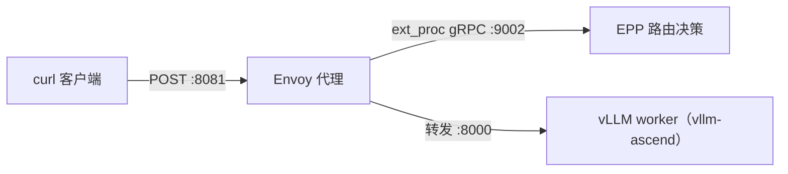

# 快速开始：在昇腾 NPU 上裸机跑通 llm-d 路由栈

你将在**一台机器、一张昇腾 NPU**上，用三个普通进程搭起 llm-d 的最小推理路径，不依赖 Kubernetes。

[llm-d](https://github.com/llm-d/llm-d) 是架在推理引擎之上的路由层。最小部署是三个进程：



- **vLLM worker** 真正跑模型。
- **EPP**（Endpoint Picker）根据本地 `endpoints.yaml` 选 worker。
- **Envoy** 接收客户端请求，先问 EPP，再转到选中的 worker。

本文基于上游 [no-kubernetes-deployment](https://github.com/llm-d/llm-d/tree/v0.9.0/guides/no-kubernetes-deployment) 指南，把 model server 换成 vllm-ascend，并把模型换成适合单卡验证的 `Qwen/Qwen3-0.6B`。上游其余 Kubernetes 指南在这里**不会**用到。

工作目录统一用 `/root/llm-d`。下面每一段命令都可以单独复制。需要 `cd` 或 `source` 的，该段里会自己写。

> **阅读本文前**，请先按 [快速安装昇腾环境](https://ascend.github.io/docs/sources/ascend/quick_install.html) 装好 CANN、NNAL 与驱动。

---

## 前置条件

### 硬件

Atlas **800T** / **900 A2** 训练系列（Ascend **910B**）。本文示例为**单卡**。

### 软件

| 类别 | 要求 |
| --- | --- |
| CANN | toolkit 9.1.0，并且可以 `source /usr/local/Ascend/ascend-toolkit/set_env.sh` |
| NNAL | 并且可以 `source /usr/local/Ascend/nnal/atb/set_env.sh`。vLLM-Ascend 会加载 ATB，只 source CANN 不够 |
| Python | 3.12 |
| 网络 | 能访问华为云 PyPI、ModelScope、`goproxy.cn`，以及 GitHub Release（Envoy 二进制） |

**配套机器**：Atlas 900 A2（Ascend 910B4）。**配套镜像**：`swr.cn-south-1.myhuaweicloud.com/ascendhub/cann:9.1.0-910b-ubuntu22.04-py3.12`。

**版本要求**

| 组件 | 版本 |
| --- | --- |
| llm-d 配置仓 | 当前最新 Release tag（克隆时换成你要用的 tag） |
| EPP（llm-d-router） | v0.10.0 |
| Go | 1.26.6 linux-arm64 |
| vLLM | 0.23.0 |
| vllm-ascend | 0.23.0 |
| triton-ascend | 3.2.2 |
| ModelScope | 1.37.1 |
| Envoy | 1.33.2 linux-aarch64 |
| 模型 | `Qwen/Qwen3-0.6B`（从 ModelScope 下载） |

安装 vLLM 0.23.0 时，pip 可能先拉 `torch` 2.11.0。随后安装 `vllm-ascend==0.23.0` 会按插件约束把 `torch` / `torch-npu` 降到 2.10.0。这是该发布对的官方顺序，不是混搭。`python -m pip check` 可能报声明冲突，**不要**把它当作成功条件。成功条件是插件激活、NPU 初始化，以及一次 completion 请求成功。

### 加载 CANN 与 NNAL

新开终端后这些变量不会自动生效。`npu-smi` 在常见容器里位于 `/usr/local/sbin` 或 `/usr/local/bin`。后面启动 vLLM 的命令段会再 `source` 一次，单独复制也能跑。

```shell
export PATH=/usr/local/sbin:/usr/local/bin:$PATH
source /usr/local/Ascend/ascend-toolkit/set_env.sh
source /usr/local/Ascend/nnal/atb/set_env.sh
```

---

## 确认 NPU 在线

```shell #test id="npu-smi"
export PATH=/usr/local/sbin:/usr/local/bin:$PATH
npu-smi info
```

输出结果如下（设备表、功耗、HBM 每次都不同，不必和任何截图逐字一致）：

```shell #test-result id="npu-smi"
...NPU...
```

若提示找不到 `npu-smi`，回到 [快速安装昇腾环境](https://ascend.github.io/docs/sources/ascend/quick_install.html) 检查驱动与设备挂载（例如 `/dev/davinci0`）。

启动前确认本机这些端口空闲：`8000`（vLLM）、`8081`（Envoy 入口）、`9002` / `9003` / `9090`（EPP）、`19000`（Envoy 管理口）。被别的任务占用时，不要去杀别人的进程，换一台机器或等端口释放。

---

## 安装 vLLM Ascend

`torch` 2.10 会顺带装上社区版 CUDA Triton。那个包没有昇腾后端，第一次推理会报 `TypeError: 'function' object is not subscriptable`。所以最后再装一次 `vllm-ascend==0.23.0` 要求的 `triton-ascend==3.2.2`，覆盖那个目录。必须放在最后，并且加 `--force-reinstall --no-deps`：前面两步会把社区版 Triton 的文件盖回来，但 pip 仍认为 `triton-ascend` 已经装过，不加强制重装就会跳过。

```shell #test id="install"
python -m pip install --no-cache-dir \
  --index-url https://repo.huaweicloud.com/repository/pypi/simple \
  vllm==0.23.0
python -m pip install --no-cache-dir \
  --index-url https://repo.huaweicloud.com/repository/pypi/simple \
  --extra-index-url https://repo.huaweicloud.com/ascend/repos/pypi/variant \
  --extra-index-url https://repo.huaweicloud.com/ascend/repos/pypi \
  vllm-ascend==0.23.0 modelscope==1.37.1
python -m pip install --no-cache-dir --force-reinstall --no-deps \
  --index-url https://repo.huaweicloud.com/repository/pypi/simple \
  --extra-index-url https://repo.huaweicloud.com/ascend/repos/pypi \
  triton-ascend==3.2.2
python -c "from importlib.metadata import version; print('vllm', version('vllm')); print('vllm-ascend', version('vllm-ascend')); print('modelscope', version('modelscope')); print('triton-ascend', version('triton-ascend'))"
```

输出结果如下：

```shell #test-result id="install"
...vllm 0.23.0
vllm-ascend 0.23.0
modelscope 1.37.1
triton-ascend 3.2.2
```

---

## 构建 EPP

EPP 来自 `llm-d-router` 的 `cmd/epp`。`make build-epp` 会起 builder 容器。没有 Docker 时，用 Go 1.26.6 直接 `go build`。`go.mod` 精确要求这个版本。国内用 `goproxy.cn`。

<!--
```shell #test-setup
set -euo pipefail
ci='/root/.cache/cosdt-ci-test/llm-d'
go_tar="$ci/go/go1.26.6.linux-arm64.tar.gz"
sum='d0507e9e9d7fe012aae570108cbd76c15de879e17130ab8cb90d4d7445cb1f2e'
mkdir -p /root/llm-d/bin
if [ -f "$go_tar" ]; then
  if echo "$sum  $go_tar" | sha256sum -c >/dev/null 2>&1; then
    if ! /root/llm-d/go/bin/go version 2>/dev/null | grep -q 'go1.26.6'; then
      rm -rf /root/llm-d/go
      tar -C /root/llm-d -xzf "$go_tar"
    fi
  else
    rm -f "$go_tar"
  fi
fi
if [ -x "$ci/epp/v0.10.0/epp" ] && [ -s "$ci/epp/v0.10.0/epp" ]; then
  cp -a "$ci/epp/v0.10.0/epp" /root/llm-d/bin/epp
fi
```
-->

```shell #test-setup
mkdir -p /root/llm-d/bin
if ! /root/llm-d/go/bin/go version 2>/dev/null | grep -q 'go1.26.6'; then
  url='https://golang.google.cn/dl/go1.26.6.linux-arm64.tar.gz'
  for _ in 1 2 3; do
    curl -fL --connect-timeout 30 --max-time 600 -o /root/llm-d/go1.26.6.linux-arm64.tar.gz.part "$url" && mv /root/llm-d/go1.26.6.linux-arm64.tar.gz.part /root/llm-d/go1.26.6.linux-arm64.tar.gz && break
    sleep 5
  done
  rm -rf /root/llm-d/go
  tar -C /root/llm-d -xzf /root/llm-d/go1.26.6.linux-arm64.tar.gz
fi
export GOROOT=/root/llm-d/go
export GOPATH=/root/llm-d/gopath
export GOPROXY=https://goproxy.cn,direct
export PATH="$GOROOT/bin:$PATH"
mkdir -p "$GOPATH"
if [ ! -x /root/llm-d/bin/epp ]; then
  rm -rf /root/llm-d/llm-d-router
  for _ in 1 2 3; do
    GIT_TERMINAL_PROMPT=0 GIT_HTTP_VERSION=HTTP/1.1 git clone --depth 1 --branch v0.10.0 https://github.com/llm-d/llm-d-router /root/llm-d/llm-d-router && break
    rm -rf /root/llm-d/llm-d-router
    sleep 5
  done
  cd /root/llm-d/llm-d-router
  go build -o /root/llm-d/bin/epp ./cmd/epp
fi
/root/llm-d/go/bin/go version
test -x /root/llm-d/bin/epp
/root/llm-d/bin/epp --help >/dev/null
```

<!--
```shell #test-setup
set -euo pipefail
ci='/root/.cache/cosdt-ci-test/llm-d'
sum='d0507e9e9d7fe012aae570108cbd76c15de879e17130ab8cb90d4d7445cb1f2e'
mkdir -p "$ci/go" "$ci/epp/v0.10.0"
if [ -f /root/llm-d/go1.26.6.linux-arm64.tar.gz ]; then
  echo "$sum  /root/llm-d/go1.26.6.linux-arm64.tar.gz" | sha256sum -c
  cp -a /root/llm-d/go1.26.6.linux-arm64.tar.gz "$ci/go/go1.26.6.linux-arm64.tar.gz.part"
  mv "$ci/go/go1.26.6.linux-arm64.tar.gz.part" "$ci/go/go1.26.6.linux-arm64.tar.gz"
elif [ -f "$ci/go/go1.26.6.linux-arm64.tar.gz" ]; then
  echo "$sum  $ci/go/go1.26.6.linux-arm64.tar.gz" | sha256sum -c
fi
test -x /root/llm-d/bin/epp
cp -a /root/llm-d/bin/epp "$ci/epp/v0.10.0/epp.part"
mv "$ci/epp/v0.10.0/epp.part" "$ci/epp/v0.10.0/epp"
```
-->

---

## 获取 Envoy

Envoy v1.33.2 官方 Release 直接提供 Linux ARM64 二进制，不需要 Docker，也不需要从源码编译。下载总超时给到 1800 秒，国内直连 GitHub Release 可能很慢。

<!--
```shell #test-setup
set -euo pipefail
ci='/root/.cache/cosdt-ci-test/llm-d'
cached="$ci/envoy/1.33.2/envoy"
sum='81ec3689a82122eff0ca680c48176f4d351b6f9881a79cc9d9078a6fb4b0b6a8'
mkdir -p /root/llm-d/bin
if [ -f "$cached" ]; then
  if echo "$sum  $cached" | sha256sum -c >/dev/null 2>&1; then
    cp -a "$cached" /root/llm-d/bin/envoy
    chmod 0755 /root/llm-d/bin/envoy
  else
    rm -f "$cached"
  fi
fi
```
-->

```shell #test-setup
mkdir -p /root/llm-d/bin
if [ ! -x /root/llm-d/bin/envoy ]; then
  url='https://github.com/envoyproxy/envoy/releases/download/v1.33.2/envoy-1.33.2-linux-aarch_64'
  for _ in 1 2 3; do
    curl -fL --connect-timeout 30 --max-time 1800 -o /root/llm-d/bin/envoy.part "$url" && chmod 0755 /root/llm-d/bin/envoy.part && mv /root/llm-d/bin/envoy.part /root/llm-d/bin/envoy && break
    sleep 5
  done
fi
/root/llm-d/bin/envoy --version
```

<!--
```shell #test-setup
set -euo pipefail
ci='/root/.cache/cosdt-ci-test/llm-d'
sum='81ec3689a82122eff0ca680c48176f4d351b6f9881a79cc9d9078a6fb4b0b6a8'
echo "$sum  /root/llm-d/bin/envoy" | sha256sum -c
mkdir -p "$ci/envoy/1.33.2"
cp -a /root/llm-d/bin/envoy "$ci/envoy/1.33.2/envoy.part"
mv "$ci/envoy/1.33.2/envoy.part" "$ci/envoy/1.33.2/envoy"
```
-->

输出里应含 `1.33.2`。若 GitHub Release 不可达，停下来查网络，不要改去抽 Docker 镜像或从源码编 Envoy。

---

## 准备 llm-d 配置

克隆 llm-d 仓，只取 no-kubernetes 指南里的三份 YAML。默认 EPP 去读 `/etc/epp/endpoints.yaml`，默认模型是 `Qwen/Qwen3-32B`。单机验证改成工作目录里的绝对路径，以及 `Qwen/Qwen3-0.6B`。`address` 必须是字面 IPv4，file-discovery **不会**解析主机名。


将下面克隆命令里的 `<ref>` 换成你要用的 llm-d **Release tag**（例如 `v0.9.0`）。
<!--
```shell #test-setup store="upstream_ref"
set -euo pipefail
ref="${UPSTREAM_REF-}"
printf '%s\n' "$ref" | grep -Eq '^[A-Za-z0-9._/-]+$'
printf '%s\n' "$ref"
```
-->

<!--
```shell #test-setup
set -euo pipefail
ci='/root/.cache/cosdt-ci-test/llm-d'
guide="$ci/guides/${UPSTREAM_REF}"
dest='/root/llm-d/src/guides/no-kubernetes-deployment'
if [ -s "$guide/config.yaml" ] && [ -s "$guide/endpoints.yaml" ] && [ -s "$guide/envoy.yaml" ]; then
  if grep -q '/etc/epp/endpoints.yaml' "$guide/config.yaml" \
    && grep -q 'Qwen/Qwen3-32B' "$guide/endpoints.yaml" \
    && grep -q '8081' "$guide/envoy.yaml"; then
    mkdir -p "$dest/router/epp" "$dest/router/envoy"
    cp -a "$guide/config.yaml" "$dest/router/epp/config.yaml"
    cp -a "$guide/endpoints.yaml" "$dest/router/epp/endpoints.yaml"
    cp -a "$guide/envoy.yaml" "$dest/router/envoy/envoy.yaml"
  else
    rm -rf "$guide"
  fi
fi
```
-->

```shell #test id="prepare-config" load="upstream_ref>>ref"
mkdir -p /root/llm-d
if [ ! -f /root/llm-d/src/guides/no-kubernetes-deployment/router/epp/config.yaml ]; then
  rm -rf /root/llm-d/src
  for _ in 1 2 3; do
    GIT_TERMINAL_PROMPT=0 GIT_HTTP_VERSION=HTTP/1.1 git clone --depth 1 --branch '<ref>' https://github.com/llm-d/llm-d /root/llm-d/src && break
    rm -rf /root/llm-d/src
    sleep 5
  done
fi
cp /root/llm-d/src/guides/no-kubernetes-deployment/router/epp/config.yaml /root/llm-d/config.yaml
cp /root/llm-d/src/guides/no-kubernetes-deployment/router/epp/endpoints.yaml /root/llm-d/endpoints.yaml
cp /root/llm-d/src/guides/no-kubernetes-deployment/router/envoy/envoy.yaml /root/llm-d/envoy.yaml
sed -i 's|/etc/epp/endpoints.yaml|/root/llm-d/endpoints.yaml|' /root/llm-d/config.yaml
sed -i 's|Qwen/Qwen3-32B|Qwen/Qwen3-0.6B|' /root/llm-d/endpoints.yaml
grep '/root/llm-d/endpoints.yaml' /root/llm-d/config.yaml
grep 'Qwen/Qwen3-0.6B' /root/llm-d/endpoints.yaml
```

<!--
```shell #test-setup
set -euo pipefail
ci='/root/.cache/cosdt-ci-test/llm-d'
src='/root/llm-d/src/guides/no-kubernetes-deployment'
guide="$ci/guides/${UPSTREAM_REF}"
mkdir -p "$guide"
cp -a "$src/router/epp/config.yaml" "$guide/config.yaml.part"
mv "$guide/config.yaml.part" "$guide/config.yaml"
cp -a "$src/router/epp/endpoints.yaml" "$guide/endpoints.yaml.part"
mv "$guide/endpoints.yaml.part" "$guide/endpoints.yaml"
cp -a "$src/router/envoy/envoy.yaml" "$guide/envoy.yaml.part"
mv "$guide/envoy.yaml.part" "$guide/envoy.yaml"
```
-->

输出结果如下：

```shell #test-result id="prepare-config"
.../root/llm-d/endpoints.yaml...Qwen/Qwen3-0.6B...
```

---

## 启动 vLLM

日志必须落到文件。若把服务丢到后台却不重定向，前台命令结束后，调用方仍会等管道关闭，看起来像挂死。PID 写入 `/root/llm-d/vllm.pid`，后面只按这个文件停进程，**不要** `pkill -f vllm`。同机可能还有别人的推理任务。

`--max-model-len 2048` 把上下文压到第一次验证够用的长度，KV cache 更小，启动更快。`--gpu-memory-utilization 0.3` 因为 0.6B 用不了一整张 910B。`--served-model-name Qwen/Qwen3-0.6B` 必须和 `endpoints.yaml` 里的 `model` 标签一致，否则 EPP 选不中这个 worker。`--enforce-eager` 关掉 graph 捕获，第一次启动更快，初始化日志也更完整。`VLLM_USE_MODELSCOPE=true` 让权重走 ModelScope。

就绪不能只看 `/v1/models` 返回 200。必须看到 `"id"` 里就是 `Qwen/Qwen3-0.6B`，以免接到同机已经在跑的别的服务。

```shell #test-setup
export PATH=/usr/local/sbin:/usr/local/bin:$PATH
source /usr/local/Ascend/ascend-toolkit/set_env.sh
source /usr/local/Ascend/nnal/atb/set_env.sh
mkdir -p /root/llm-d
export VLLM_USE_MODELSCOPE=true
export ASCEND_RT_VISIBLE_DEVICES=0
export PYTORCH_NPU_ALLOC_CONF=expandable_segments:True
port_busy() {
  python - "$1" <<'PY'
import socket, sys
p = int(sys.argv[1])
s = socket.socket()
s.settimeout(0.3)
r = s.connect_ex(('127.0.0.1', p))
s.close()
raise SystemExit(0 if r == 0 else 1)
PY
}
vllm_alive() {
  [ -f /root/llm-d/vllm.pid ] || return 1
  pid=$(cat /root/llm-d/vllm.pid)
  kill -0 "$pid" 2>/dev/null || return 1
  tr '\0' ' ' < "/proc/$pid/cmdline" 2>/dev/null | grep -q vllm
}
if vllm_alive; then
  echo 'vllm already running'
else
  if port_busy 8000; then
    echo 'port 8000 is already in use by another process' >&2
    exit 1
  fi
  setsid -f sh -c 'echo $$ > /root/llm-d/vllm.pid; exec vllm serve Qwen/Qwen3-0.6B --host 127.0.0.1 --port 8000 --served-model-name Qwen/Qwen3-0.6B --max-model-len 2048 --max-num-seqs 4 --gpu-memory-utilization 0.3 --trust-remote-code --enforce-eager >/root/llm-d/vllm.log 2>&1'
fi
python - <<'PY'
import os, sys, time, urllib.request
deadline = time.time() + 2400
last = ''
pid = None
while time.time() < deadline:
    if pid is None:
        try:
            pid = int(open('/root/llm-d/vllm.pid', encoding='utf-8').read().strip())
        except (OSError, ValueError):
            time.sleep(0.2)
            continue
    try:
        os.kill(pid, 0)
    except OSError:
        sys.stderr.write('vllm process exited\n')
        try:
            sys.stderr.write(open('/root/llm-d/vllm.log', encoding='utf-8', errors='replace').read()[-8000:])
        except OSError:
            pass
        raise SystemExit(1)
    try:
        with urllib.request.urlopen('http://127.0.0.1:8000/v1/models', timeout=5) as resp:
            body = resp.read().decode()
        last = body
        if 'Qwen/Qwen3-0.6B' in body:
            print(body)
            raise SystemExit(0)
    except SystemExit:
        raise
    except Exception as exc:
        last = repr(exc)
    time.sleep(5)
sys.stderr.write('vllm not ready: %s\n' % last)
raise SystemExit(1)
PY
```

装好 `triton-ascend` 之后，启动日志里不应再出现 `0 active driver(s)`。仍可能看到 `Failed to import Triton kernels` / `constexpr_function`：那是另一条非致命导入，Qwen3-0.6B 仍可完成推理。若推理时报 `TypeError: 'function' object is not subscriptable`，把安装段最后一步再跑一遍。

---

## 启动 EPP

`--pool-name` 和 `--pool-namespace` 在 file-discovery 模式下不是 Kubernetes 对象，只出现在指标和日志里。`--secure-serving=false` 因为 Envoy 和 EPP 同机，不走 TLS。

```shell #test-setup
mkdir -p /root/llm-d
port_busy() {
  python - "$1" <<'PY'
import socket, sys
p = int(sys.argv[1])
s = socket.socket()
s.settimeout(0.3)
r = s.connect_ex(('127.0.0.1', p))
s.close()
raise SystemExit(0 if r == 0 else 1)
PY
}
epp_alive() {
  [ -f /root/llm-d/epp.pid ] || return 1
  pid=$(cat /root/llm-d/epp.pid)
  kill -0 "$pid" 2>/dev/null || return 1
  tr '\0' ' ' < "/proc/$pid/cmdline" 2>/dev/null | grep -q /root/llm-d/bin/epp
}
if epp_alive; then
  echo 'epp already running'
else
  if port_busy 9002 || port_busy 9003 || port_busy 9090; then
    echo 'EPP ports 9002/9003/9090 are already in use' >&2
    exit 1
  fi
  setsid -f sh -c 'echo $$ > /root/llm-d/epp.pid; exec /root/llm-d/bin/epp --config-file=/root/llm-d/config.yaml --pool-name=file-discovery --pool-namespace=default --grpc-port=9002 --grpc-health-port=9003 --metrics-port=9090 --secure-serving=false --v=2 >/root/llm-d/epp.log 2>&1'
fi
python - <<'PY'
import os, sys, time, urllib.request
deadline = time.time() + 120
last = ''
pid = None
while time.time() < deadline:
    if pid is None:
        try:
            pid = int(open('/root/llm-d/epp.pid', encoding='utf-8').read().strip())
        except (OSError, ValueError):
            time.sleep(0.2)
            continue
    try:
        os.kill(pid, 0)
    except OSError:
        sys.stderr.write('epp process exited\n')
        try:
            sys.stderr.write(open('/root/llm-d/epp.log', encoding='utf-8', errors='replace').read()[-8000:])
        except OSError:
            pass
        raise SystemExit(1)
    try:
        with urllib.request.urlopen('http://127.0.0.1:9090/metrics', timeout=5) as resp:
            print(resp.read()[:200].decode(errors='replace'))
        raise SystemExit(0)
    except SystemExit:
        raise
    except Exception as exc:
        last = repr(exc)
    time.sleep(2)
sys.stderr.write('epp not ready: %s\n' % last)
raise SystemExit(1)
PY
```

---

## 启动 Envoy

配置里的入口是 `0.0.0.0:8081`，管理口是 `127.0.0.1:19000`。`--concurrency 2` 对单卡验证够用。

三个进程都会在启动它们的那个 shell 退出时被当成该停机。所以这里用 `setsid -f` 先 fork 再 `exec`，让进程过继给系统 init，当前命令结束后还在。

```shell #test-setup
mkdir -p /root/llm-d
port_busy() {
  python - "$1" <<'PY'
import socket, sys
p = int(sys.argv[1])
s = socket.socket()
s.settimeout(0.3)
r = s.connect_ex(('127.0.0.1', p))
s.close()
raise SystemExit(0 if r == 0 else 1)
PY
}
envoy_alive() {
  [ -f /root/llm-d/envoy.pid ] || return 1
  pid=$(cat /root/llm-d/envoy.pid)
  kill -0 "$pid" 2>/dev/null || return 1
  tr '\0' ' ' < "/proc/$pid/cmdline" 2>/dev/null | grep -q envoy
}
if envoy_alive; then
  echo 'envoy already running'
else
  if port_busy 8081 || port_busy 19000; then
    echo 'Envoy ports 8081/19000 are already in use' >&2
    exit 1
  fi
  setsid -f sh -c 'echo $$ > /root/llm-d/envoy.pid; exec /root/llm-d/bin/envoy --service-node envoy-proxy --log-level warn --concurrency 2 --drain-strategy immediate --drain-time-s 60 -c /root/llm-d/envoy.yaml >/root/llm-d/envoy.log 2>&1'
fi
python - <<'PY'
import os, sys, time, urllib.request
deadline = time.time() + 120
last = ''
pid = None
while time.time() < deadline:
    if pid is None:
        try:
            pid = int(open('/root/llm-d/envoy.pid', encoding='utf-8').read().strip())
        except (OSError, ValueError):
            time.sleep(0.2)
            continue
    try:
        os.kill(pid, 0)
    except OSError:
        sys.stderr.write('envoy process exited\n')
        try:
            sys.stderr.write(open('/root/llm-d/envoy.log', encoding='utf-8', errors='replace').read()[-8000:])
        except OSError:
            pass
        raise SystemExit(1)
    try:
        with urllib.request.urlopen('http://127.0.0.1:19000/ready', timeout=5) as resp:
            print(resp.read().decode())
        raise SystemExit(0)
    except SystemExit:
        raise
    except Exception as exc:
        last = repr(exc)
    time.sleep(2)
sys.stderr.write('envoy not ready: %s\n' % last)
raise SystemExit(1)
PY
```

---

## 发送请求验证

请求打到 Envoy 的 8081 端口，经过 EPP 选路，再由 vLLM 生成。`max_tokens` 只取 8，用来确认全链通，不是用来看模型质量。

```shell #test id="e2e"
curl -sS http://127.0.0.1:8081/v1/completions \
  -H 'Content-Type: application/json' \
  -d '{"model":"Qwen/Qwen3-0.6B","prompt":"Hello","max_tokens":8,"temperature":0}'
```

输出结果如下（生成文本每次不同，关键是 JSON 类型和模型名；`curl -sS` 默认打成一行）：

```shell #test-result id="e2e"
...text_completion...Qwen/Qwen3-0.6B...
```

---

## 确认跑在 NPU 上

`Platform plugin ascend is activated` 只说明插件被发现了，不说明设备初始化成功。初始化日志里的 `backend=hccl` 才表示这次 worker 走了昇腾通信后端。这条命令读的是启动时写下的日志文件。

```shell #test id="npu-anchor"
grep -m1 'backend=hccl' /root/llm-d/vllm.log
```

输出结果如下：

```shell #test-result id="npu-anchor"
...backend=hccl...
```

若这一行不存在，先看 `/root/llm-d/vllm.log` 是否在更早阶段就失败（缺 NNAL、卡不可见、权重没下完）。不要只凭 `/v1/models` 返回 200 下结论。

---

## 清理

只读取本任务写下的 PID 文件。先看 `/proc/<pid>/cmdline` 是不是自己的进程，再结束对应进程组。对不上就丢掉这个文件。不要 `pkill -f vllm` / `pkill -f epp` / `pkill -f envoy`。

```shell #test-setup
stop_one() {
  local f="$1"
  local needle="$2"
  if [ ! -f "$f" ]; then
    return 0
  fi
  local pid
  pid=$(cat "$f")
  if [ -z "$pid" ] || [ ! -r "/proc/$pid/cmdline" ]; then
    rm -f "$f"
    return 0
  fi
  case "$(tr '\0' ' ' < "/proc/$pid/cmdline")" in
    *"$needle"*) ;;
    *)
      rm -f "$f"
      return 0
      ;;
  esac
  if kill -0 "$pid" 2>/dev/null; then
    kill -- -"$pid" 2>/dev/null || kill "$pid" 2>/dev/null || true
    for _ in $(seq 1 50); do
      kill -0 "$pid" 2>/dev/null || break
      sleep 0.2
    done
    if kill -0 "$pid" 2>/dev/null; then
      kill -9 -- -"$pid" 2>/dev/null || kill -9 "$pid" 2>/dev/null || true
    fi
  fi
  rm -f "$f"
}
stop_one /root/llm-d/envoy.pid envoy
stop_one /root/llm-d/epp.pid /root/llm-d/bin/epp
stop_one /root/llm-d/vllm.pid vllm
```

---

## 常见问题

| 现象 | 可能原因 | 建议 |
| --- | --- | --- |
| `libatb.so` / `_register_atb_extensions` | 没有 source NNAL | 在**同一段**命令里 `source /usr/local/Ascend/nnal/atb/set_env.sh` |
| `KeyError: 'Type'` 或 ModelScope repository 无效 | ModelScope 版本太新 | 钉 `modelscope==1.37.1`，不要无版本安装 |
| `/v1/models` 是 200，但模型名不是 `Qwen/Qwen3-0.6B` | 8000 端口上是别人的 vLLM | 不要占用别人的端口。停掉**自己 PID 文件**里的进程后换端口或换机器 |
| 启动命令挂住、一直不返回 | 后台进程没把日志重定向到文件，管道写端没关 | 三个进程都用本文的 `setsid -f sh -c 'echo $$ > pid; exec ... >log 2>&1'` |
| 启动块一结束进程就退出，日志有 `caught ENVOY_SIGTERM`，`curl :8081` 连接拒绝 | 进程把父 shell 退出当成停机 | 用本文的 `setsid -f sh -c 'echo $$ > pid; exec ...'`，不要 `setsid nohup ... &` |
| `npu-smi: command not found` | 不在默认 `PATH` | `export PATH=/usr/local/sbin:/usr/local/bin:$PATH` |
| Envoy 返回 503 | EPP 未就绪，或 `endpoints.yaml` 里的地址不是 `127.0.0.1` | `curl http://127.0.0.1:9090/metrics`，并确认 endpoints 是字面 IPv4 |
| `git clone` GitHub 443 超时或 `HTTP2 framing layer` | 国内直连 GitHub 不稳定 | 用本文的 HTTP/1.1 + 三次重试 |
| 第一次推理 `TypeError: 'function' object is not subscriptable` | 社区版 CUDA Triton 覆盖了昇腾后端 | 在 vllm-ascend 之后用 `--force-reinstall --no-deps` 再装 `triton-ascend==3.2.2` |
